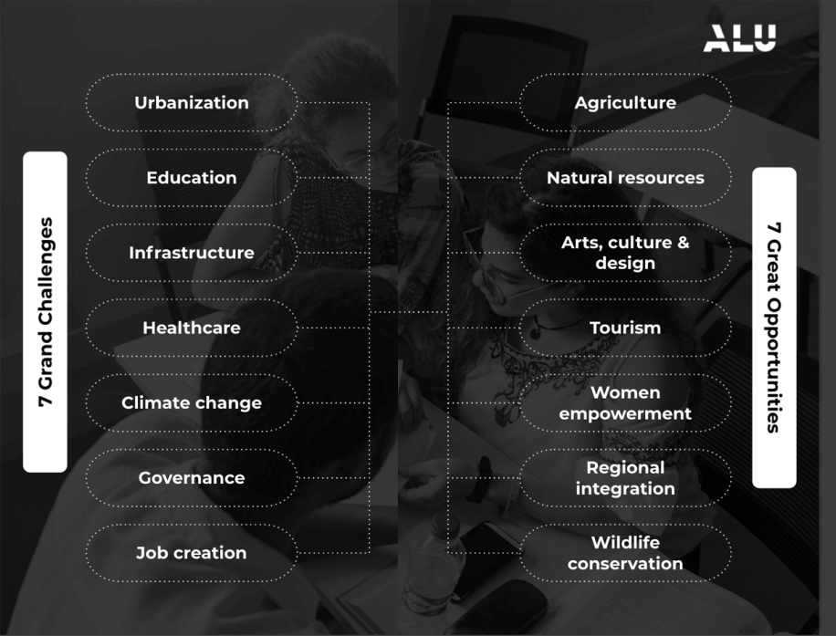

# GLOBAL CHALLENGES GLOBAL OPPORTUNITIES

## Starting with Your WHY

Let’s talk more about your WHY.

Most people can only speak to WHAT they do; some are clear on HOW to get the job done, but few think about the WHY. In his LinkedIn article [Education in the time of AI: 6 shifts the world needs to make](https://www.linkedin.com/pulse/education-time-ai-6-shifts-world-needs-make-fred-swaniker), Fred Swaniker guides that in this tech-led era, **‘Why’ will matter more than ‘what’**.

Here is another chance to take a step back and deeply consider your WHY.

+ Why are you here on Canvas?
+ Why did you register for a program with ALX?
+ Why did you choose to pursue a career in tech?
+ What are those driving factors that have you doing hard things?

## What is your WHY?

To help you think through and answer these paramount questions, watch this powerful and classic TedTalk by Simon Sinek who speaks to the power of knowing your WHY. It will soon help you realize that people don’t buy what you create or do, they buy WHY you do it.

After watching the video, take time to reflect on Sinek’s talk and explore your “why” for being in this program. Refer back to the questions we asked above and answer each one to the best ability.

>
> Reference: [https://www.ted.com/talks/simon_sinek_how_great_leaders_inspire_action/no-comments](https://www.ted.com/talks/simon_sinek_how_great_leaders_inspire_action/no-comments)
>

## Why We Share GCGOs

Believing in something and having a purpose brings us back to the conversation on Grand Challenges and Great Opportunities (GCGOs).

We believe that cutting-edge solutions to the world’s biggest challenges and opportunities are in tech. Understanding the issues and gaps being faced by society will set you up for innovative success. It will help you better articulate your WHY for doing something and – like the Wright brothers did – develop solutions that change the course of the world for the better.

**A few more inspiring people who fulfill(ed) their purpose in service to the world:**

+ Nelson Mandela studied Law and served South Africa through his unrelenting involvement in the anti-apartheid movement.
+ Garrett Camp is helping solve the world’s public transport challenges through ride-hailing.
+ Susie Lonie and Nick Hughes created M-Pesa to help the millions of people who do not have bank accounts to transfer money quickly, easily and safely using mobile phones. M-Pesa – and other mobile money services across the globe – has lifted the limitation associated with not having a bank account and has radically transformed economies on the continent.

### Do you see a trend?

And that’s why understanding GCGOs is integral to building a meaningful career trajectory. As a young tech professional and leader, we want you to be courageous, resolute, creative and passionate about solving the Continent’s (and the world’s) greatest challenges and seizing and making the most of global opportunities.

## GCGOs: A Closer Look

### We see you, trailblazer

Are you ready to dive in and use your skills to help solve some of these challenges?

This week will take a closer look at 7 of the GCGOs: Urbanisation, Regional Integration, Climate Change, Agriculture, Job Creation, Healthcare and Wildlife Conversation. As you learn more about each one take note of:

+ 1. Why each area is labelled a challenge or opportunity.
+ 2. The role that tech is playing in bringing solutions and change.
  
>
> **question mark**
>
> As you complete this content, also, consider the following questions::
>
> + What do I want to accomplish and contribute to society?
> + At first glance, which GCGO resonates with me the most?
> + What challenges/opportunities feel most interesting and important to me?
> + In what ways (big or small) might I creatively weave my career and societal contribution (or GCGO of choice) together over the next year?
> + What resources can I curate to learn more about merging my path in tech with the GCGO(s) that resonate(s) with me?
>

### Let’s dive in

By the way, because we are covering 7 GCGOs this week, we have split them into three sections for you over the course of this week. This is part 1, covering Urbanization and Regional Integration.

## Global Challenge: Urbanization

>
> “So, here’s a prediction. If we get our cities right, we just might survive the 21st century. We get > them wrong, and we’re done for.”
>
> **Robert Muggah**
>

What a bold opening remark by Robert Muggah in his Ted Talk on cities and Urbanization. As you watch make note of the researched perspectives on Urbanization, its impact, and the possibilities of what society can do differently to address this growing challenge.

**As you’re watching this video, ask yourself the following questions:**

1. How does Muggah describe the “two-sided nature” of cities? Why are they essential for our society, yet also so damaging?
2. Why are cities at risk in the long run?
3. What are the most effective solutions to the issues plaguing cities?

Would you have known that urbanization has such a huge impact on Climate Change, citizen safety and global poverty levels? The real question remains: **How can we use Technology to tackle Urban Problems?**

We are glad you are thinking that far! The good news is that Technology is presenting lasting solutions and several countries are on to it. Take a moment to read this [optional article](https://www.worldbank.org/en/news/feature/2021/01/18/harnessing-smart-technology-for-sustainable-development-in-developing-countries-tdlc) for a clear picture of how tech is being deployed by developing countries to bring about change. As you read note how technology helped Yokohama, Japan resolve its urbanization challenges to become a leading smart city.

The transcript for Ted Talk can be found here: [https://www.ted.com/talks/robertmuggahthebiggestrisksfacingcitiesandsome_solutions](https://www.ted.com/talks/robertmuggahthebiggestrisksfacingcitiesandsome_solutions)

>
> References: [https://youtu.be/Sv5QitqbxJw](https://youtu.be/Sv5QitqbxJw)
>

## Global Challenge: Tech x Urbanization

### Companies applying technology to solve urbanization challenges

When it comes to urbanization, here’s an example of a company that’s tackling urbanization challenges at scale for the city of Hangzhou in China. Remember, this is just one example of companies tackling urbanization. There are multiple companies solving challenges around infrastructure, and waste management among other sub-sectors within the urbanization space. So expand your thinking and explore the many challenges that exist within the urbanization space. Millions of people are waiting for your solutions to help alleviate their issues!

**The City Brain project**, an artificial intelligence (AI)-driven urban management platform, was developed by Alibaba Group in collaboration with the government of Hangzhou, China. This project aims to address a range of urbanization challenges in China, including traffic congestion, public safety, and environmental pollution. Here are some ways in which the City Brain project is tackling these challenges:

+ **Traffic management**: The City Brain project uses real-time data from sensors and cameras installed throughout the city to optimize traffic flow and reduce congestion. The system can adjust traffic signals and reroute vehicles based on real-time conditions, reducing travel times and improving overall mobility in the city. Talk about data-driven efficiency!
+ **Public safety**: The City Brain platform uses AI (which we’ll introduce in this module) to analyze data from a range of sources, including surveillance cameras and social media feeds, to identify potential security threats and respond to emergencies more quickly. The system can detect abnormal behaviour patterns and alert authorities to potential incidents, enabling faster and more effective response times. This of course also brings to light ethical considerations we need to make when applying technology in problem solving, and this point falls right within that grey area.
+ **Smart city planning**: The City Brain platform provides urban planners with a range of data-driven insights that can inform more effective and sustainable urban development. By analyzing data on population demographics, transportation patterns, and other factors, the system can help to identify areas where infrastructure investments are most needed and where new development should be prioritized.

Overall, the City Brain project is an innovative approach to urban management that leverages the power of AI and data analytics to tackle some of the most pressing urbanization challenges in China. We could definitely use a startup solving some of such problems for Africa.

**As you watch the video below, ask yourself the following questions:**

1. How is the “City Brain” meant to work? What types of data can it collect and leverage?
2. How can the “City Brain” use access to all kinds of data to improve city issues like traffic?
3. What other technologies might help alleviate the challenges that cities are facing?

>
> Refrences: [https://www.youtube.com/watch?v=v4_2QuS4Xns](https://www.youtube.com/watch?v=v4_2QuS4Xns)
>

## Global Opportunity: Regional Integration

When barriers are minimized society’s potential is maximized! We can see a living example of this in Western Europe. You may have heard how all of the EU uses the same currency and has incredible ease and very few restrictions on work and travel thanks to Schengen and union residency. All this gives EU residents access to opportunities and benefits that few other places provide.

How would a similar, tailor-made, concept benefit the Continent of Africa? Take a look at this short video.

**As you watch the video, ask yourself the following questions**:

1. In your own words, how would you describe regional integration?
2. What are the benefits of regional integration for Africans across the continent?
3. How the African continent better pursue and enable regional integration?

>
> **question mark**
>
> Something to think about:
>
> + What are your thoughts on regional integration in Africa? Share your thoughts with your Squad on the Portal.
>

>
> Refrences: [https://youtu.be/lfgyix6U_gI](https://youtu.be/lfgyix6U_gI)
>

## Global Opportunity: Tech x Regional Integration

### Companies applying technology to solve regional integration challenges

Regional integration is challenging because it’s a multi-faceted challenge. This means that in order to completely solve this, multiple industries such as road, internet, and financial infrastructure, need to have matured to help with the cause.

For example, a huge part of regional integration is being able to trade with one another. To do that, you need financial infrastructure to facilitate payments across borders and the ability to move goods safely and in good time to mention only a few things that need to work flawlessly.

Some companies working in the regional integration space include payment facilitators such as Flutterwave which aims to power a new wave of prosperity across Africa with fin-tech products that combine finance and technology.

Feel inspired by this video on how Flutterwave is bridging the gap for African entrepreneurs. We definitely want you to be part of the story and our goal is to soon have links to your startups and companies, tackling big challenges like the one below.

As you watch this video, ask yourself the following questions:

1. How has Flutterwave as a financial technology tool helped Winston Leather expand its footprint internationally?
2. If Flutterwave did not exist, how would Winston Leather’s business growth be affected?
3. What other examples of cross-border technologies do you know that have eased regional integration?

Honourable mention to Symphony AI, an **AI-powered platform** that uses AI to detect patterns and anomalies in financial data and identify potential risks. Take a moment to think about potential challenges that could arise from giving such access to an AI platform. Don’t worry, if you do not know what AI is, we’re going to introduce this to you this week.

>
> Refrences: [https://youtu.be/j0jY5P4b82s](https://youtu.be/j0jY5P4b82s)
>

## Global Challenge: Climate Change

>
> “We face a huge challenge, but we already know many solutions”
>
> **<https://www.un.org>**
>

Climate change is a trending global concern that calls for an immediate solution within the next couple of years.

As stated in this [United Nations article](https://www.un.org/en/climatechange/what-is-climate-change), Climate change refers to long-term shifts in temperatures and weather patterns. Such shifts can be natural, due to changes in the sun’s activity or large volcanic eruptions. But since the 1800s,human activities have been the main driver of climate change, primarily due to the burning of fossil fuels like coal, oil and gas.1

Burning fossil fuels generates greenhouse gas emissions that act like a blanket wrapped around the Earth, trapping the sun’s heat and raising temperatures.1

The main greenhouse gases that are causing climate change include carbon dioxide and methane. These come from using gasoline for driving a car or coal for heating a building, for example. Clearing land and cutting down forests can also release carbon dioxide. Agriculture, oil and gas operations are major sources of methane emissions. Energy, industry, transport, buildings, agriculture and land use are among themain sectors causing greenhouse gases.1

Continue to read [the United Nations article](https://www.un.org/en/climatechange/what-is-climate-change) to get a clear understanding of climate change, its main contributors and the vast solutions that are already being implemented.

### Companies applying technology to solve climate change

A tech startup, [Sylvera](https://www.sylvera.com/), approaches carbon reduction within the industry and supply chain based on its combination of its SaaS (Software as a Service) digital platform and API (Application Programming Interface), which serve as a data verifier to help the carbon offset market scale. 2

More specifically, Sylvera works with offset projects to increase their validity by running geospatial data, machine learning, and climate data through their algorithms to create a standardized rating for a specific carbon offset project.

>
> **question mark** 
>
> Take a look around you…
>
> What other companies have you heard of that are tackling challenges associated with climate change?
>

>
> Refrences:
>
>> [https://www.plugandplaytechcenter.com/resources/future-thinking-startups-fighting-climate-change/](https://www.plugandplaytechcenter.com/resources/future-thinking-startups-fighting-climate-change/)
>> [https://www.un.org/en/climatechange/what-is-climate-change](https://www.un.org/en/climatechange/what-is-climate-change)
>

## Global Opportunity: Agriculture

**Okay, this might sound conflicting, right? Since agriculture is notorious for being one of the highest emitters of greenhouse gasses, does it mean we must stop farming?**

**No**! It means there is a HUGE opportunity to implement sustainable agricultural ways that support our climate and its inhabitants.

The World Bank is seizing the opportunity to implement Climate-Smart Agriculture (CSA) in countries across the globe. **Climate-smart agriculture (CSA)** is an integrated approach to managing landscapes—cropland, livestock, forests and fisheries—that address the interlinked challenges of food security and accelerating climate change. CSA aims to simultaneously achieve three outcomes.1

1. Increased productivity: Produce more and better food to improve nutrition security and boost incomes, especially for 75 percent of the world’s poor population, who live in rural areas and mainly rely on agriculture for their livelihoods.
2. Enhanced resilience: Reduce vulnerability to drought, pests, diseases and other climate-related risks and shocks; and improve capacity to adapt and grow in the face of longer-term stresses like shortened seasons and erratic weather patterns.
3. Reduced emissions: Pursue lower emissions for each calorie or kilo of food produced, avoid deforestation from agriculture and identify ways to absorb carbon from the atmosphere.1

The first 2 points speak to opportunities in Agriculture, while the 3rd point addresses Agriculture’s impact on Climate Change.

>
> Refrences:
>
>> [https://www.worldbank.org/en/topic/climate-smart-agriculture](https://www.worldbank.org/en/topic/climate-smart-agriculture)
>> [https://www.forbes.com/sites/forbestechcouncil/2022/07/25/technology-powers-the-next-generation-of-climate-smart-agriculture/?sh=161ee73758fe](https://www.forbes.com/sites/forbestechcouncil/2022/07/25/technology-powers-the-next-generation-of-climate-smart-agriculture/?sh=161ee73758fe)
>

## Global Opportunity: Tech x Agriculture

### And yes, you guessed it! Tech is at the forefront of implementing CSA

What previously was not possible due to the lack of data and visibility is becoming possible today thanks to a range of technologies that make monitoring agricultural practices and measuring their environmental outcomes possible on a global scale. These technologies are not only fascinating but are key to enabling the next generation of climate-smart agriculture.

So what are these new technologies that enable leading agricultural producers and food manufacturers to gain visibility into the state and the impact of global food production? These include satellite imagery, big data and impact models (that are used as crop and soil simulators run in the cloud).

>
> **In addition to solving Climate Change, CSA is also inadvertently solving two other Global Challenges: >Job Creation and Health Care.**
>
> 1. Job creation through income generation for 75% of the world’s poor communities.
> 2. Healthcare through improved nutritional security.
>
> One good deed really does go a long way.
>

### Honourable Mention

**Blue River Technology** is an AI-powered platform that uses computer vision to identify and spray weeds in crops without harming the actual crops. This will undoubtedly help the world immensely with food production, and reduce the harmful effects of chemical use in agriculture over the next century.You can get a glimpse of their work in this **optional video.**

>
> Refrences:
>
>> + [https://youtu.be/-YCa8RntsRE](https://youtu.be/-YCa8RntsRE)
>> + [https://www.worldbank.org/en/topic/climate-smart-agriculture](https://www.worldbank.org/en/topic/climate-smart-agriculture)
>> + [https://www.forbes.com/sites/forbestechcouncil/2022/07/25/technology-powers-the-next-generation-of-climate-smart-agriculture/?sh=161ee73758fe](https://www.forbes.com/sites/forbestechcouncil/2022/07/25/technology-powers-the-next-generation-of-climate-smart-agriculture/?sh=161ee73758fe)
>

## Global Challenge: Job Creation

The way of work as we knew it has shifted, making it possible for many people to create careers in areas that were deemed unconventional in the past. Many people have had the good fortune to convert their interests into lucrative sources of income, while others have benefited from digital jobs that only ask for remote productivity.

That being said, a huge job creation gap still needs to be addressed the world over. According to the United Nation, **Over the next decade, close to 600 million people will be looking for jobs, mostly in the world’s poorest countries**. In 2018 [the Food and Agriculture Organization (FAO)](content/agric_emp.pdf) reported that there was a huge opportunity to harness agriculture and food systems as an engine for jobs. At the time of their report, 200 Million people were looking for jobs. Take a minute to read this short article for insights into how agriculture and food systems can be a solution.

Technology, Healthcare and Hospitality are also expected to create millions of jobs by 2030.

### Companies applying technology to solve job creation challenges

You might have heard of an Africa based company called [Andela](https://www.andela.com/) which has been operational for a couple of years now. Andela is one of the companies applying technology to bridge the gap in job creation in Africa. This is also a chance to practice some research skills to figure out what Andela’s value proposition is. What does Andela do and how are they helping to solve the jobs problem in Africa?

>
> Refrences:
>
>> + [https://youtu.be/-YCa8RntsRE](https://youtu.be/-YCa8RntsRE)
>> + [https://www.fao.org/3/i8625en/I8625EN.pdf](https://www.fao.org/3/i8625en/I8625EN.pdf)
>

## Global Challenge: Healthcare

Covid disrupted the world’s approach to healthcare and forced the community to take Health trends more seriously. According to World Economic Forum, there are 8 Health trends to watch for in 2023, one of which is mental health and well-being. Take a moment to read [the full article](https://www.weforum.org/agenda/2023/04/world-health-day-healthcare-trends/#:~:text=The%20challenges%20faced%20by%20the%20global%20health%20and%20healthcare%20sector,related%20challenges%20and%20macroeconomic%20instability) to understand each trend.

It is encouraging to note that world leaders have healthcare on their main agenda and key discussions are focused on Covdid-19, Mental Health, Tuberculosis and the impact of climate change on children’s health. Key corporates like Deloitte have health equity as a priority. Finally, the global healthcare outlook predicts digital transformation will revolutionize the healthcare sector.

### Companies applying technology to solve regional integration challenges

As we have learned in the resource above, healthcare challenges have always plagued countries across the globe. Africa is no exception. There has been an explosion in healthcare startups and companies trying to solve problems in the space. One of these companies is Daktari Online whose platform connects patients with licensed healthcare providers who can diagnose and treat a range of health conditions via video chat, helping to improve access to healthcare services in Kenya.

What other companies do you know of that are helping solve challenges in the healthcare industry?

## Global Opportunity: Wildlife Conservation

Wildlife refers to all non-domesticated plants, animals, and other organisms living in their natural habitats. This includes a wide variety of creatures, from large mammals like lions and elephants to tiny insects like bees and butterflies. Wildlife is an important part of our natural world and plays a critical role in maintaining ecosystems and biodiversity. However, many species of wildlife are threatened by habitat loss, climate change, and other human activities, making conservation efforts important to protect these creatures and their habitats.

The International Institute of Sustainable Development (IISD) reports that:

**More than 40,000 species are threatened with extinction.**

That means the next generation might never get to see some species.

As the world becomes warmer the rate of extinction of species accelerates. Why is this a problem? Because the destruction of the natural world is causing various negative impacts on human health including;

+ Increased exposure to disease
+ Worsened air and water quality
+ Decreased food production
+ Deepened impact of extreme weather events
+ Weakened ability to combat climate change
+ Decreased well-being

>
> Refrences: [https://www.iisd.org/articles/deep-dive/protecting-endangered-species](https://www.iisd.org/articles/deep-dive/protecting-endangered-species)
>

## Wildlife Conservation In Action

One brilliant solution presented by a young conservationist from Zimbabwe is to get local communities involved in conservation efforts. Take a look.

As you watch the video, ask yourself the following questions:

1. Why does the speaker say that it is important for communities to be involved in wildlife conservation?
+2 What methods are recommended to increase local community involvement in conservation?

>
> **question mark**
>
> Something to think about::
>
> + What endangered species are found in your home country?
> + Why are they endangered?
> + What are your thoughts on the local community getting involved with conserving endangered wildlife within the local areas? What are the pros and cons?
>
> Share your thoughts with your squad on The Portal.
>

>
> Refrences: [https://youtu.be/pR83Woy0zDs](https://youtu.be/pR83Woy0zDs)
>

## More Wildlife Conservation in Action [Optional]

Here are a few more examples of companies using technology to take on the wildlife conservation challenge. This page is optional, but we highly recommend you go through these videos as they contain lessons as well as inspiration for you!

### EarthRanger

One company doing amazing work is Earth Ranger which uses Artificial Intelligence and the Global Positioning System (GPS) to monitor wildlife movements and potentially prevent human-wildlife conflict by mobilizing support to get animals back within their geofences. See this amazing video on how the company is doing this.

As you watch the video, ask yourself the following questions:

1. How does EarthRanger work to protect wildlife?
2. What are the key technological innovations that allow EarthRanger to be successful?
3. What other technology can promote wildlife protection?

### ALU Graduates

Our sister institution, ALU, offers studies in Wildlife Conservation as part of their  MBA class. Take a look at some of the work the graduates are doing. Inspiring!

As you watch the video, ask yourself what makes the ALU School of Wildlife Conservation so special, and why a degree like this is essential for the progress of the African continent.

>
> Refrences:
>>
>> + [https://youtu.be/sT5kPMGnIuw](https://youtu.be/sT5kPMGnIuw)
>>
>> + [https://youtu.be/UajE6cV9nsE?feature=shared](https://youtu.be/UajE6cV9nsE?feature=shared)
>