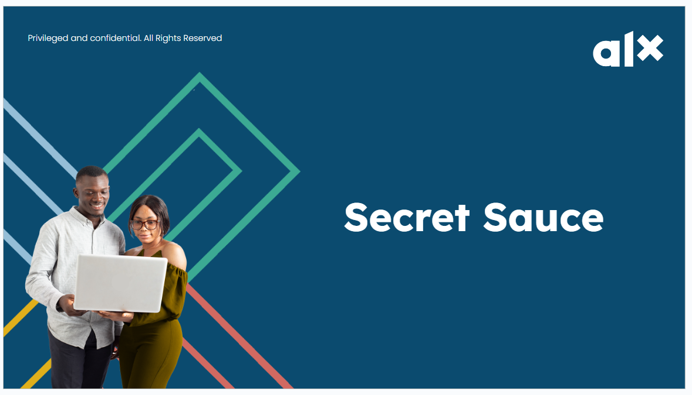
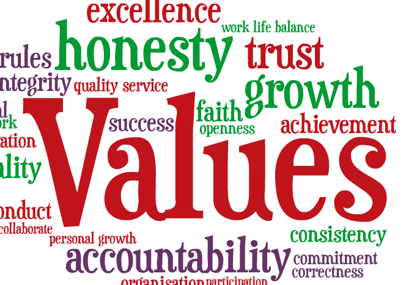
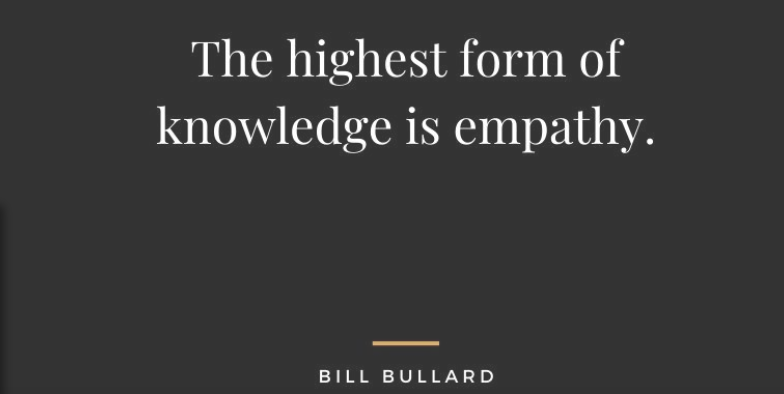
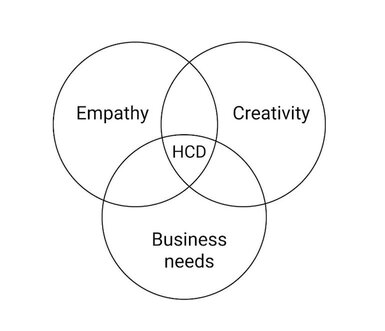
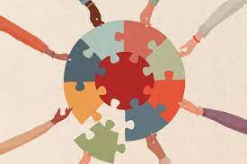
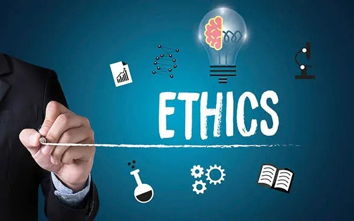
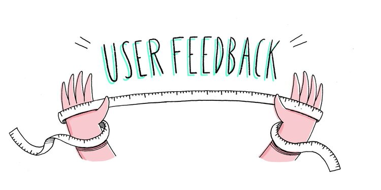
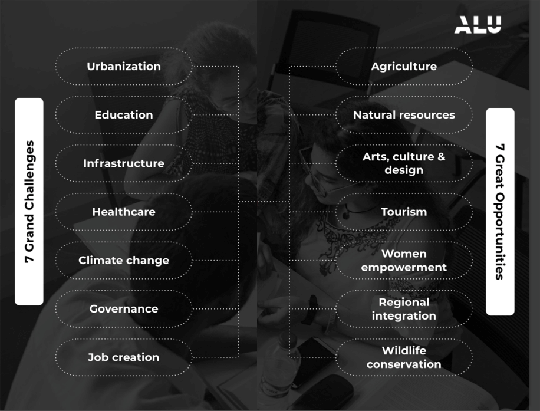
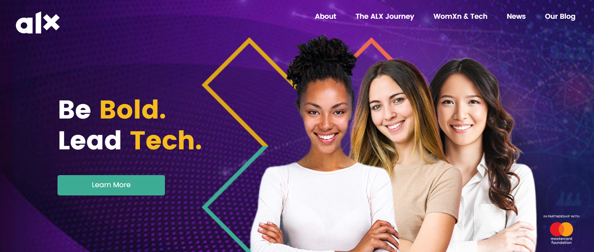

# Movements

## Daily 3: Movement

**Get out of your head and get into your body!**

We’ve already introduced you to the 1st tool of the Daily 3 - **MOVEMENT**.

There is a massive amount of research on the many valuable benefits of regular exercise. These include physical health, improved mood, productivity, and creativity. In fact, the time you invest in movement you get back in increased productivity later! It’s a win-win.

This week, Movement will be our main focus. You will take baby steps to begin developing the habit of doing some kind of movement EVERY DAY. The goal is for you to find some kind of movement you enjoy and set a schedule that you build up and stick to over the next 15 weeks (and beyond).

The most important thing is NOT that you do exercise of any particular kind. It is that you **just move your body in some way, every day**. We’d like you to do 20 minutes minimum, but if 20 minutes feels too big to start with, then start smaller! The most important thing is that you do SOMETHING.

## The 7 Minute Workout

<iframe src="https://giphy.com/embed/xT9DPkf3WHxiyF4mis" width="100%" height="100%" style="position:absolute" frameBorder="0" class="giphy-embed" allowFullScreen></iframe>

<a href="https://giphy.com/gifs/vice-spain-xT9DPkf3WHxiyF4mis">via GIPHY</a>

**So here is what you need to do this week:**

1. **The most important step is commitment**. If you don’t decide now that this is important, then you are already set up to fail. Your commitment comes from understanding your “why”– we’ve told you that movement is important and has lots of benefits, but do you believe it? Are you committed to doing this? If your answer is “not really”– then ask yourself why and talk to others about it. What are you realistically willing to commit to?

We’d like you to make a commitment to move every day. If you can’t do 20 minutes to start, that’s ok. Say to yourself out loud, “I am going to move every day for X minutes.” This works even better if you tell other people. So tell your friends and family. Hop on to your virtual community and tell your squad! You can do it!

2. **Schedule it!** Decide when you can move each day. Mornings are a great time; some prefer mid-day or after dinner. Sometimes your schedule may be up in the air, so you can put 2 time slots into your schedule in case the first one doesn’t work out. Put these times in your Google Calendar.

3. **Pick any kind of movement/exercise that you enjoy**. You also need to pick a movement that supports your health and your body can take. Not all body types are the same so pick a movement that works well for you. It doesn’t have to be just one activity either. You could experiment with trying different movements every day: walking, hiking, climbing stairs, boxing, dancing, aerobics, HIIT, yoga, biking, etc. It’s all great! So pick something and move every day, preferably at a consistent time, so it becomes part of your daily routine.

4. **Actually do your chosen movement** at the scheduled times. Remember, SOMETHING is way better than NOTHING. So even if you don’t make it to 20 minutes, do 10. If you can’t do 10, do 5. If you can’t do 5, do 1!

5. **Track what you do each day.** You could note this in your calendar, or in a Google doc. There are also many free habit-tracking apps that you can download and use.

**Remember that [NYT 7-minute workout?](https://www.nytimes.com/video/well/100000007527127/standing-7-min-workout.html) You can give it a try this week. You could actually try it now while you are still on this page.**

## Movement: Resources

It’s always good to have friends to help with your motivation! To keep your motivation up, you could work with a peer close to your location or encourage your family and friends to join in.

**At the end of the week (as part of Milestone 2), we are going to ask you to report how much you moved and to provide a written reflection on your movement experience.**

Other movements you can do are walking, dancing, running or doing something that releases those endorphins and gives you some joy.Here is a short and fun Afrobeat workout that you could do. There are so many options to be found on YouTube and elsewhere, so experiment and find something fun that actually works for you.

**NOTE**: We always want you to put your health first, and you know you best! If any of the options we provided are beyond what your body can take, then look for options that better suit you. Many people just walk, and that’s fantastic!

Happy Moving!

>
> References: [https://youtu.be/ERZF-FeIXdk](https://youtu.be/ERZF-FeIXdk)
>

## Movement Challenge

**Let’s have some fun!**

Our challenge to you this week is to move (walking, running, biking, aerobics, boxing, weights, dancing, etc.) for 20 minutes every day for 7 days. You can move in different ways every day or the same. Just move! Are you brave enough to accept?? You won’t be sorry!

As an example of one movement you could do, take a look at #CalmDownChallenge. It’s fun and easy. **If you know you nailed it, share your short video with your squad so we can learn a move or two from you!**

If you accept our challenge, tell us on the next page!

Here is an entertaining Calm Down Challenge video tutorial that we found. You don’t have to watch the entire thing, if you can get the motion with the first few instructions!

**NOTE**: We always want you to put your health first. You know you best so only do what your body allows you to! If any options we provide are beyond what your body can do, please choose options that work for YOU. Remember, 5 minutes of movement is way better than 0 minutes and some movement is way better than none.

>
> References: [https://www.youtube.com/watch?v=uTaNkOzg9qE](https://www.youtube.com/watch?v=uTaNkOzg9qE)
>

## Secret Sauce Part 1

### Your Non-negotiable Values

If you’ve been paying attention, you must have noticed how every successful person we’ve talked about is known for their strong sense of values and how they’re driven by them. Having a set of values you live and work by gives you the edge others might not have! This is why it’s so important to know what your values are, and keep them in your mind as you make every decision. You’ve covered the CHAIR values with us – **Courage, Humility, Initiative, Adventure, and Resilience** – let us talk about an additional set of values. Your PERSONAL values.

These are the values that you personally hold as “non-negotiable”. Here are some possibilities to jumpstart your thinking:

**Autonomy/Independence | Self-awareness & Self-management | Growth Mindset | Grit/Perseverance | Excellence | Creativity | Imagination | Honesty | Curiosity | Integrity | Empathy | Emotional Intelligence | Pan-Africanism | Global Citizenship**

Highly successful people are consciously aware of their values, and practice them, even when it is hard. This is why having personal non-negotiable values is one of the secret sauces we pride ourselves in teaching.

Part of being a thoughtful, conscientious leader is to make sure that you are holding yourself accountable to knowing and living your values, as much as possible throughout your career and lifetime. One way to do this is to be very clear with yourself on what your **personal non-negotiables** are – in other words, what are the values and elements of your life that matter the most to you?

For example, when looking at the list above, which of the values are your top 3? You can think of these things as your BIG ROCKS. Let’s unpack this on the next page.

### Your Rocks Pebbles and Sand

This next video will help us understand more about rocks, pebbles and sand. Make note of what each entails and ask yourself:

+ What are my rocks?
+ What are my pebbles?
+ What makes up my sand?

>
> Refrences: [https://img.youtube.com/watch?v=cPgMeKfQFq8](https://www.youtube.com/watch?v=cPgMeKfQFq8)
>

### The Ideal ALX Graduate

Let’s get more specific. As an ALX graduate, not only do we expect you to build a set of character traits and values that are essential for any leader, but we also expect you to use these as the foundation for the rest of your career and your life.

To understand what we mean by this, you can think about a tree.

Every tree has four main parts:

+ **The roots**, which keep the tree grounded and act as a source of water/life
+ **The trunk**, which connects the roots to the rest of the tree and acts as a sturdy foundation
+ **The branches**, which allow the tree to grow, flourish and bear fruit
+ **The leaves**, which show that the tree is healthy and thriving

This tree symbolizes you as an individual:

+ Your roots are your **values and character**, which keep you stable and firmly planted
+ Your trunk is your **foundational soft and hard skills**, which act as your central base and allow for your branches to grow
+ Your branches are your **specialized skill sets**, which allow you to expand your reach and your impact
+ Your leaves are your **experiences**, which demonstrate the lessons you’ve learned and the growth you have attained over many years

Without roots and a trunk, storms may blow your tree down. Storms can be in the form of challenging life events (e.g. family members passing, getting fired from a job). If your roots and trunk are strong, you can easily grow again regardless of the weather.

<iframe src="https://giphy.com/embed/HmTLatwLWpTQk" width="100%" height="100%" style="position:absolute" frameBorder="0" class="giphy-embed" allowFullScreen></iframe>

<a href="https://giphy.com/gifs/wind-weather-miami-HmTLatwLWpTQk">via GIPHY</a>

On the other hand, without branches and leaves, you would never be able to attract others towards you or share what you have with the rest of your community. With branches and leaves, you can grow to become expansive, and even assist other trees in growing as well.

An ideal ALX graduate recognizes that all parts of their tree are essential to being a change-making leader in the world!

>
> **question mark**
>
> What is your tree made out of?
>
> + Grab a pen and draw it out! List out what your roots, trunk, branches and leaves are made of.
> + Reflect and review as you feel necessary.
>

## Secret Sauce Part 2

### What is Empathy

>
> “Love and compassion are necessities. They are not luxuries. Without them, humanity cannot survive.”
>
> _Dalai Lama_
>

The mark of an effective leader is the ability to be aware of the people you interact with. To do this, one must always seek to relate to the feelings, needs, and experiences of others. And this is why it’s our second secret sauce for success! The next two videos will help us explore and experience empathy from various lenses.

>
> **question mark**
>
> As you complete this content, essential questions that we want to answer are:
>
> + What is empathy?
> + Why is empathy important?
> + How do I know if I’m being empathetic?
>

For a conceptual understanding of empathy start by watching Dr. Brene Brown’s 3-minute ‘What is Empathy?’ video.

>
> Refrences: [https://www.youtube.com/watch?v=1Evwgu369Jw](https://www.youtube.com/watch?v=1Evwgu369Jw)
>

### The Importance of Empathy

Next up, continue to read Daniel Goleman’s article: [What Makes a Leader](https://drive.google.com/file/d/1J9uBFBLZBjNqogEIw75zax9KLfNd3tEG/view?usp=sharing). Focus especially on the section on empathy and also note the three kinds of empathy.

As you read and after you have read, use these questions to guide your understanding and relation to the articles.

+ How do the resources above define empathy?
+ Why is it important to be empathetic?
+ What are the different types of empathy Daniel Goleman shares?
+ What are the similarities and differences you notice from Goleman’s different types of empathy?
+ Compare and contrast the resources above. What do you notice?

Lastly, watch The Importance of Empathy video below, by Lifehacker.

>
> Refrences: [https://youtu.be/UzPMMSKfK](https://youtu.be/UzPMMSKfK)
>

### Empathy for Problem Solving

>
> “Empathetic problem solving is the ability to really understand and feel another’s perspective in a conflict or issue. Empathetic problem-solving is about what you do in communication while solving a problem but also about what you don’t do.”
>
> _Chris Stathakis_
>

That’s the statement that jumped out in this 2-minute read called [The Art of Problem Solving by Chris Stathakis](https://www.stathakis.com/blog/leadership/the-art-of-empathetic-problem-solving). Read it and pay special attention to the differences between empathetic problem-solving and Non-empathetic problem-solving.

We will talk more about problem-solving in the coming weeks. For now, it’s important for you to grasp the value of empathy and its pivotal role in problem-solving.

### Additional Resources on Empathy

Still curious and eager to learn more about empathy? Well, we love this TED talk by Daniel Goleman calledWhy Aren’t We More Compassionate?

As you watch this 12 minute TED talk, ask yourself (If you’re pressed for time, you can watch at 1.5x or 2x speed):

1. Why are people less compassionate than they could be?
2. What circumstances make people more compassionat

>
> Refrences:
>
> + **Transcript:** [https://www.ted.com/talks/danielgolemanwhyarentwemore_compassionate/transcript](https://www.ted.com/talks/danielgolemanwhyarentwemore_compassionate/transcript)
> + **Video:** [https://youtu.be/r3wyCxHtGd0?feature=shared](https://www.youtube.com/watch?v=r3wyCxHtGd0)
>

### Significance of Empathy in Technology Teams

Empathy is a crucial skill for everyone working in technology. Well, it’s an important skill that everyone should have but specific emphasis is placed on technology teams since you’re most likely going to have different roles in these teams in the near future.

We’ve learned in the previous lessons that empathy is the ability to understand and relate to the feelings of others. This makes it a crucial skill to be used in building meaningful connections with colleagues you’re going to work with and users who’ll use the awesome technology platforms you’ll build or contribute to.

In order to understand how empathy might impact us in our roles, we need to examine the following hypothetical case study that might be a reflection of the amazing work you’re soon going to be doing.

Image showing many connected people's hands in a collaborative manner
Imagine you are part of a team tasked with designing a new healthcare app for people with chronic conditions. The app aims to help users track their symptoms, medications, and appointments, and provide personalized health tips and resources. The app also seeks to have this information shareable with healthcare providers so that no information is lost in case the providers are changed for one reason or another. Well let’s talk about empathy as it relates to this project. How would empathy ensure that the goals are met?

1. **Human centered design (HCD):** also called user centered design, this is a term you’re likely going to see** countless times in your tech career. When you understand the pain points, preferences and needs of users, you’re showing empathy to your users and the end result is creation of products/solutions/apps that are intuitive, user-friendly, and enjoyable to use.

With regards to our healthcare app, your team would most likely conduct intensive user research to understand the needs and pain points of people with chronic conditions. This would likely be through interviewing participants or conducting surveys among other user research methodologies we’re going to mention in future learning modules.

In this case, after interviewing potential users of the healthcare app, you learn that many users feel overwhelmed by the complexity of managing their conditions while navigating the public healthcare system which is cumbersome. With this information, you can design the app to be user-friendly, intuitive to use and customizable to each user’s needs.

2. **Collaboration:** while researching, designing, and developing the healthcare app, your team collaborates with insurance providers, healthcare providers, and people with chronic conditions. By listening to their perspectives and feedback, empathy is demonstrated and the end result is building trust and creating a supportive community that values diverse
voices.

3. **Ethics and integrity:** while developing the healthcare app and integrating feedback provided by your stakeholders, there are ethical considerations that need to be made that particularly affect technology teams. These range from factors such as data privacy and accessibility (especially when dealing with healthcare data). In your near future role in a tech team, you need to be an advocate for user data protection ensuring that it’s well secured and access appropriately managed.

4. **User feedback:** after launching the app, it’s always good practice to collect feedback and data from your users to be used for improvement of their experience on the app. It shows empathy to your users that you still care enough about their experience to continue iterating on your app to improve it for the future. You should always respond to feedback with empathy.

By putting yourself in the shoes of the user and understanding their problems, needs, and perspectives, you can design technology that makes a meaningful impact on people’s lives. In summary, empathy is a crucial skill for anyone working in technology. By practicing empathy, you can build user-centered technology solutions, collaborate effectively with colleagues, consider ethical implications, give, and receive feedback constructively.

## GCGOs: An Even Closer Look

Remember the 7 GCGOs we looked at last week? Let’s recount them; Urbanization, Regional Integration, Climate Change, Agriculture, Job Creation, Healthcare and Wildlife Conservation.

This week we will explore the remaining 7: **Women Empowerment, Education, Tourism, Infrastructure, Arts, Culture and Design, Governance and Natural Resources. We have split them into two sections over the course of this week.**

We share these big challenges and opportunities with you to inspire you to think big about your purpose and how you can make an important difference in this world!

>
> question mark
> As you learn more about each of these 7 GCGOs think about:
>
> + Why each area is labelled a challenge or opportunity?
> + The role that tech is playing in bringing solutions and change.
> + At first glance, how much does each GCGO resonate with me?
> + What do I want to accomplish and contribute to society?
> + What challenges/opportunities feel most interesting and important to me?
> + In what ways (big or small) might I creatively weave my career and societal contribution (or GCGO of choice) together over the next year?
> + What resources can I explore to learn more about merging my path in tech with the GCGO that resonates the most with me?
>

**Let’s get started!**

### Global Opportunity: Women Empowerment

Due to the need for equality across the globe, a key focus for the United Nations – and one of the Strategic Development Goals – is Gender Equality and Women’s Empowerment.

Throughout Africa and the world, countries continue to have deeply ingrained gender inequality. Women, for centuries, have struggled with access to respectable employment, occupational segregation, and gender wage inequalities. They frequently face prejudice and violence while also being denied access to basic healthcare and education. They are also underrepresented in political and economic decision-making processes. [1]

#### There has been notable progress in the space and a lot must still be done

In December 2022, Forbes.com released a list of the [World’s Most Empowered Women](https://drive.google.com/file/d/1m9JFMxIcZpTGgOYbURuT9p2xOKRSOENb/view) which hopefully is inspirational to us all. That being said, you will note that only a few African nationalities are represented on the list. This is another reminder that a lot still needs to be done to empower women on the African Continent.

ALX Africa is committed to addressing this continental plight. One way ALX is helping close the gender gap is through the Women in Tech Initiative which equips women to lead careers in a historically male-dominated industry. In 2023, ALX had its first-ever all-female Software Engineering cohort. Some of you are even part of this distinguished group!

#### What a great time it is to be part of ALX

You can read all about ALX Women in Tech Initiative [here](https://drive.google.com/file/d/1i-web0OYDLMCl_NFfT7O1yKZkL0YcPdi/view).

>
> Refrences:
>
> + **100 Most Powerful Women:** [https://sdgs.un.org/topics/gender-equality-and-womens-empowerment](https://sdgs.un.org/topics/gender-equality-and-womens-empowerment)
> + **ALX Women in Tech:** [https://www.forbes.com/lists/power-women/?sh=319e26055a95](https://www.forbes.com/lists/power-women/?sh=319e26055a95)
>

### Global Challenge: Education

The United Nations Strategic Development Goal Number 4 is to:

**Ensure inclusive and equitable quality education and promote lifelong learning opportunities for all.**

When taking a closer look at the Continent, Africa is experiencing significant disparities in education. According to the latest State of Global Education Update:

+ 9 in 10 children in Sub-Saharan Africa cannot read and understand a simple text by the age of 10.
+ 160 million students in Eastern and Southern African countries were out of school for some time due to COVID-related school closures.
+ 70% of these students can’t read – up from 57% before the COVID-19 pandemic. [1]

Children who were out of school failed to learn what they were supposed to and, in some cases, even forgot the skills they had previously acquired. [1]

These statistics are shocking. So what are some of the solutions being implemented to address this problem of education on the African Continent?

One of the solutions is what we are experiencing right now. The United Nations, World Bank and key corporates like Mastercard Foundation, are heavily investing in Education in Africa. Mastercard Foundation’s ambitious goal is to enable 30 million young people in Africa, especially young women, to secure employment they see as dignified and fulfilling by 2030. [2]

The African Union is developing a manifesto called Agenda 2063: The Africa We Want [3], and part of the manifesto’s mandate is to address the Education challenge on the continent.

Governments are also applying technology to address this need. Let’s talk more about it on the next page.

>
> Refrences:
>
> + <https://blogs.worldbank.org/africacan/what-will-it-take-africa-lead-education-turnaround>
> + htps://mastercardfdn.org/who-we-are
> + <https://au.int/en/agenda2063/overview>
>

### Global Challenge: Tech x Education

Technology is once again unearthing solutions to the education challenges in Africa.

The government of Rwanda has implemented a technology-led initiative called RwandaEQUIP. The transformative program is making the country’s basic education system globally competitive. Underpinning RwandaEQUIP is **data-driven technology** where teachers are supported with tablets to deliver customized lesson plans optimized for students and also provide a feedback loop of data. Without the technology, measuring and driving improvement in this way would be impossible.

This works hand-in-hand with [NewGlobe](https://newglobe.education/home-page/): an organization well known for supporting national governments in creating powerful technology-enabled education systems.

In southern Nigeria, the EdoBEST education transformation programme has been running since 2018 in Edo state. This, and other programs in Kenya, Liberia, Lagos and Kwara states in Nigeria, are all based on the NewGlobe technology-based education systems.

ALI graduates are also applying their skills to solve the education challenges on the continent. Farai Mujoma, ex-Deputy Chief of Staff to Fred Swaniker, is the Founder of [Shasha](https://www.shashanetwork.com/) an educational network whose Moonshot is to provide a one-stop shop for all the **on-demand digital education** needs in Africa.

Take a look at this short video and as you watch ask yourself:

1. How Shasha is maximizing tech tools to simplify learning and increase access to information for both teachers and students?
2. What notable difference has Shasha made in their user’s education journey?

>
> References:
>
> + <https://www.weforum.org/agenda/2022/11/education-learning-africa/>
> + <https://newglobe.education/home-page/>
> + **Video:** <https://youtu.be/esxVttJLlPY>
>
