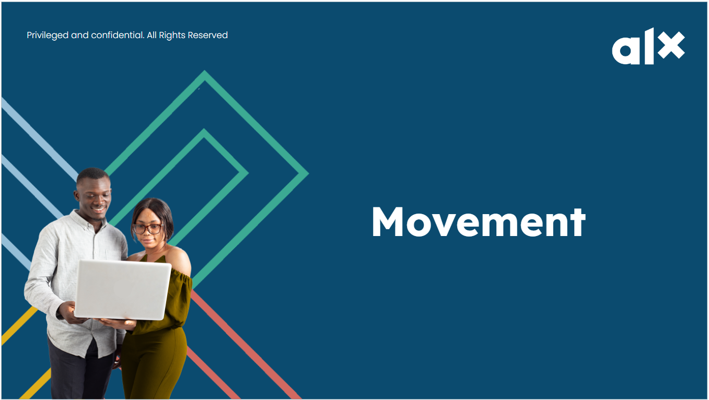
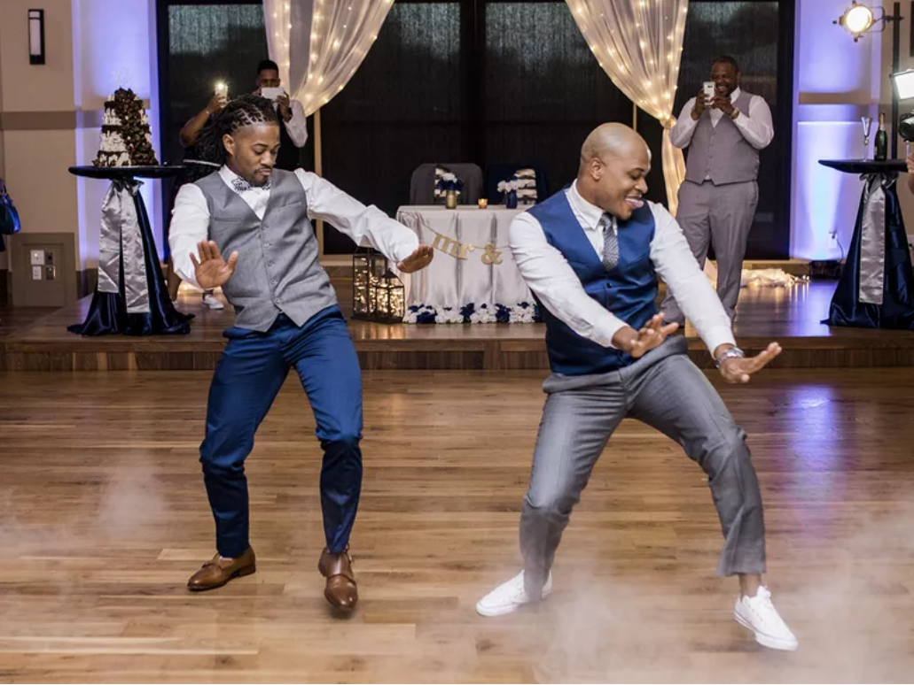

# Movements

## Daily 3: Movement

**Get out of your head and get into your body!**

We’ve already introduced you to the 1st tool of the Daily 3 - **MOVEMENT**.

There is a massive amount of research on the many valuable benefits of regular exercise. These include physical health, improved mood, productivity, and creativity. In fact, the time you invest in movement you get back in increased productivity later! It’s a win-win.

This week, Movement will be our main focus. You will take baby steps to begin developing the habit of doing some kind of movement EVERY DAY. The goal is for you to find some kind of movement you enjoy and set a schedule that you build up and stick to over the next 15 weeks (and beyond).

The most important thing is NOT that you do exercise of any particular kind. It is that you **just move your body in some way, every day**. We’d like you to do 20 minutes minimum, but if 20 minutes feels too big to start with, then start smaller! The most important thing is that you do SOMETHING.

## The 7 Minute Workout

<iframe src="https://giphy.com/embed/xT9DPkf3WHxiyF4mis" width="100%" height="100%" style="position:absolute" frameBorder="0" class="giphy-embed" allowFullScreen></iframe>

<a href="https://giphy.com/gifs/vice-spain-xT9DPkf3WHxiyF4mis">via GIPHY</a>

**So here is what you need to do this week:**

1. **The most important step is commitment**. If you don’t decide now that this is important, then you are already set up to fail. Your commitment comes from understanding your “why”– we’ve told you that movement is important and has lots of benefits, but do you believe it? Are you committed to doing this? If your answer is “not really”– then ask yourself why and talk to others about it. What are you realistically willing to commit to?

We’d like you to make a commitment to move every day. If you can’t do 20 minutes to start, that’s ok. Say to yourself out loud, “I am going to move every day for X minutes.” This works even better if you tell other people. So tell your friends and family. Hop on to your virtual community and tell your squad! You can do it!

2. **Schedule it!** Decide when you can move each day. Mornings are a great time; some prefer mid-day or after dinner. Sometimes your schedule may be up in the air, so you can put 2 time slots into your schedule in case the first one doesn’t work out. Put these times in your Google Calendar.

3. **Pick any kind of movement/exercise that you enjoy**. You also need to pick a movement that supports your health and your body can take. Not all body types are the same so pick a movement that works well for you. It doesn’t have to be just one activity either. You could experiment with trying different movements every day: walking, hiking, climbing stairs, boxing, dancing, aerobics, HIIT, yoga, biking, etc. It’s all great! So pick something and move every day, preferably at a consistent time, so it becomes part of your daily routine.

4. **Actually do your chosen movement** at the scheduled times. Remember, SOMETHING is way better than NOTHING. So even if you don’t make it to 20 minutes, do 10. If you can’t do 10, do 5. If you can’t do 5, do 1!

5. **Track what you do each day.** You could note this in your calendar, or in a Google doc. There are also many free habit-tracking apps that you can download and use.

**Remember that [NYT 7-minute workout?](https://www.nytimes.com/video/well/100000007527127/standing-7-min-workout.html) You can give it a try this week. You could actually try it now while you are still on this page.**

## Movement: Resources

It’s always good to have friends to help with your motivation! To keep your motivation up, you could work with a peer close to your location or encourage your family and friends to join in.

**At the end of the week (as part of Milestone 2), we are going to ask you to report how much you moved and to provide a written reflection on your movement experience.**

Other movements you can do are walking, dancing, running or doing something that releases those endorphins and gives you some joy.Here is a short and fun Afrobeat workout that you could do. There are so many options to be found on YouTube and elsewhere, so experiment and find something fun that actually works for you.

**NOTE**: We always want you to put your health first, and you know you best! If any of the options we provided are beyond what your body can take, then look for options that better suit you. Many people just walk, and that’s fantastic!

Happy Moving!

>
> References: [https://youtu.be/ERZF-FeIXdk](https://youtu.be/ERZF-FeIXdk)
>

## Movement Challenge

**Let’s have some fun!**

Our challenge to you this week is to move (walking, running, biking, aerobics, boxing, weights, dancing, etc.) for 20 minutes every day for 7 days. You can move in different ways every day or the same. Just move! Are you brave enough to accept?? You won’t be sorry!

As an example of one movement you could do, take a look at #CalmDownChallenge. It’s fun and easy. **If you know you nailed it, share your short video with your squad so we can learn a move or two from you!**

If you accept our challenge, tell us on the next page!

Here is an entertaining Calm Down Challenge video tutorial that we found. You don’t have to watch the entire thing, if you can get the motion with the first few instructions!

**NOTE**: We always want you to put your health first. You know you best so only do what your body allows you to! If any options we provide are beyond what your body can do, please choose options that work for YOU. Remember, 5 minutes of movement is way better than 0 minutes and some movement is way better than none.

>
> References: [https://www.youtube.com/watch?v=uTaNkOzg9qE](https://www.youtube.com/watch?v=uTaNkOzg9qE)
>

