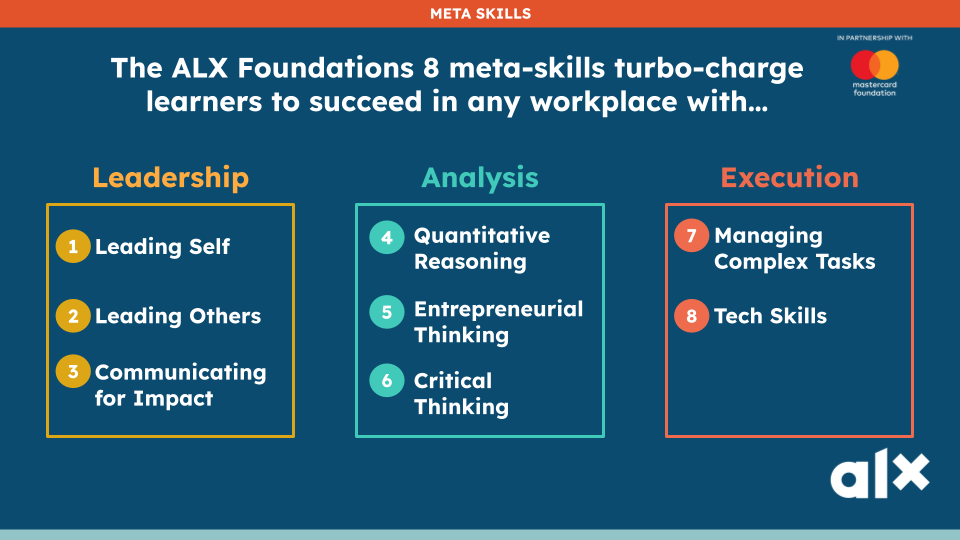
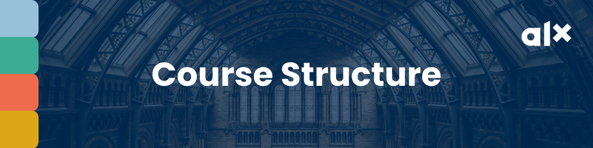
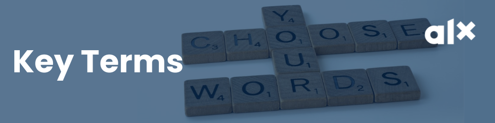
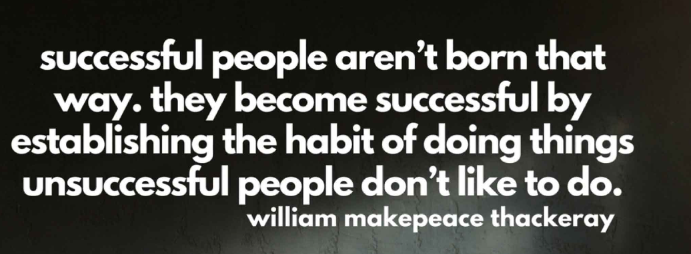
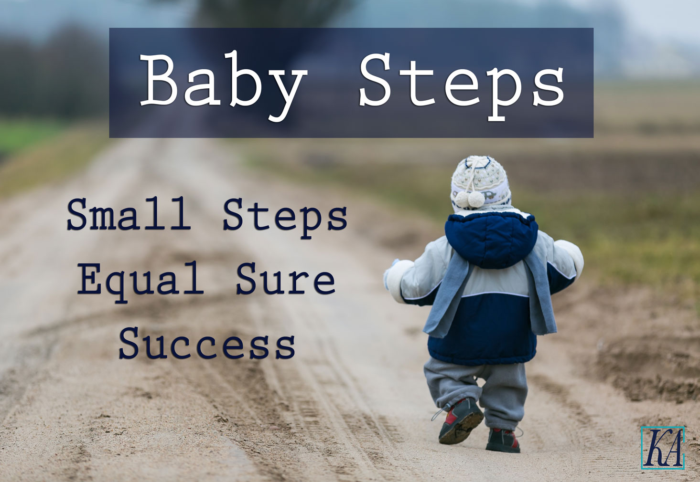
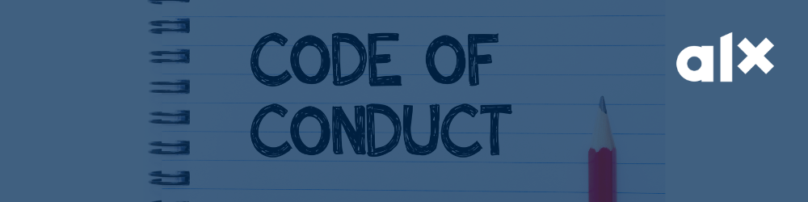
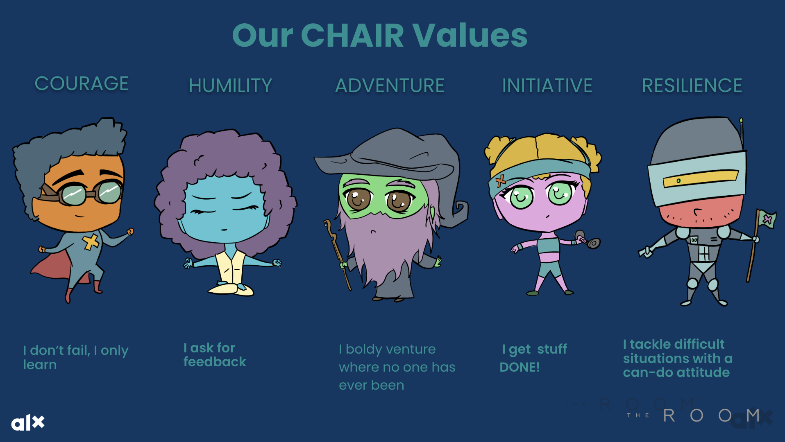
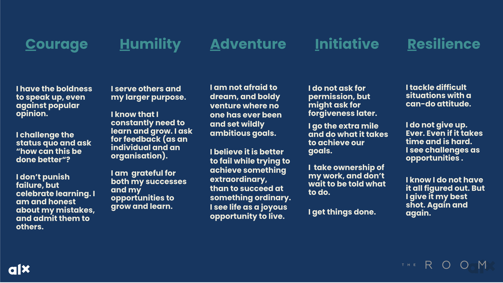

# ALX FOUNDATION PROGRAM OVERVIEW

## Program Overview Part 1

### What Makes this Program Unique?

**There are many programs out there that teach foundational tech skills so why is this program so unique?**

#### You’ll Acquire the Complete Package

You’ll receive training on skills that are in high demand in the professional world. Skills that some of the leading talent management consultancies and professionals swear by. Taking you far beyond just being a tech guru!

#### The Holistic Approach

The ALX Foundation Program will equip you with key tools, and critical soft and technical skills. You will also invest your time in discovering who you are, developing your character, forming healthy lifestyle habits, and exploring rewarding ways to merge your professional aspirations and mission. We will empower you to skillfully navigate and confidently lead the different aspects of your day-to-day.

#### The Content: “ALX Secret Sauce”

We have already talked about the secret sauce a few times. This program will unlock your ability to build and practice additional critical real-world skills that are highly sought after by employers and clients. As an ALX Professional Foundations Program grad, you will be self-aware, aligned with your values, a great communicator and collaborator, humble and empathetic, and an analytical and creative thinker. You will be well-equipped for your job search as you will hold insider secrets for successfully finding and creating work opportunities and standing out in job interviews.

#### Peer Support

As part of this program, you will become a member of a community. Within that community, you will belong to a smaller group called a Squad, which consists of other peers who are also going through the program. As Squad members, you will regularly communicate via Circle, offer peer coaching sessions to one another, and support and motivate one another throughout the entire learning journey.

From Squads, smaller teams are formed that collaborate on group projects (in-person or virtually). Many past ALX participants report that the connections made in their Squads and teams were what enabled them to complete the course successfully. These connections are often carried forward and form the foundation of the learners’ professional networks.

#### Real-World Focus and Applied Projects

Unlike traditional courses, all learning content and assignments/milestones are designed to help you develop critical skills that you actually need for the real world of work. Weekly Tests are designed to help you assess whether you have understood the content. Milestones are designed to simulate projects done in the workplace and provide you with actual work samples.

Read more about what makes the ALX Professional Foundations Program the amazing experience it is by downloading the program brochure [here](content/foundations_program.pdf).

### Secret Sauce: 8 Meta-Skills

Let’s explore the 8 meta-skills further. As you read, think about how you would rate yourself on each one.

As we shared, the AL team conducted research that included interviewing over 200 executives across Africa and around the world to discover the answer to one key question: _“What skills are most important for entry-level employees to have when they work for your company?”_

What resulted from work was a list of 7 “meta-skills” that almost all employers agreed were _essential _to success for young people in today’s modern workplace. These skills are as follows:

#### LEADING SELF

Those skilled at leading self see “failure” as a learning opportunity. They pursue their vision even through adversity. They use all of their real-world experience for growth.

> **Key Characteristics**:
>
> + Self-awareness
> + Proactivity
> + Lifelong Values
> + Self-improvement
> + Self-regulation
>

#### LEADING OTHERS

Today’s employers seek people who can take charge when the situation requires it, define a project’s direction, and collaborate with co-workers.

> **Key Characteristics**:
>
> + Empathy
> + Diversity
> + Relationship Building
> + Feedback
> + Collaboration
>

#### ENTREPRENEURIAL THINKING

You don’t have to be an entrepreneur to benefit from entrepreneurial thinking.  People with this mindset pursue their vision even through adversity. They see their real-world experience as an opportunity to learn and grow.

> **Key Characteristics**:
>
> + Systems Thinking
> + Identifying Opportunities
> + Human-Centred Thinking
> + Creativity and Innovation
> + Continuous Iteration
>

#### QUANTITATIVE REASONING

Employers want quantifiable results. The ability to collect and evaluate data and use it to determine the most effective and efficient way to approach problems is a very valuable skill.

> **Key Characteristics**:
>
> + Data Contextualisation
> + Uncertainty and Modeling of the Real World
> + Empirical Research
> + Data-based Decision Making
> + Quantitative Problem Solving
>

#### MANAGING COMPLEX TASKS

The ability to look at a complex project from multiple perspectives is another highly sought-after skill.

> **Key Characteristics**:
>
> + Scoping
> + Structuring
> + Planning
> + Coordination
> + Execution
>

#### COMMUNICATION FOR IMPACT

Your brilliant ideas will do you no good if you can’t effectively share them with others. A deep understanding of your audience is just as important as what you say and how you say it.

> **Key Characteristics**:
>
> + Audience Awareness
> + Writing Process
> + Voice
> + Organising for Effective Communication
> + Storytelling and Presentation
>

#### CRITICAL THINKING

Today’s successful professionals don’t jump to conclusions or assume outcomes—they critically examine facts and carefully consider solutions.

> **Key Characteristics**:
>
> + Authentic Inquiry
> + Evidence/Research Analysis
> + Arguments and Judgement
> + Synthesis
>

#### AND…

In addition to the 7 meta-skills above, you will be learning **one extra meta-skill.** We’re throwing in this bonus because as tech professionals, it’s also critical.

Of course, as you venture out into the world to become leaders in technology,specifically, it is also crucial that you have the appropriate tech skills to be able to succeed in your chosen tech tracks and leverage all the tools that are available to today’s modern workforce.

In learning about the tech ecosystem, you will understand:

>
> - ✔ How to work in Technical & Product Teams
> - ✔ Tech Tools
> - ✔ Ethics in Tech
> - ✔ Technical Literacy
> - ✔ Tech Track Specialization
>

Learning and practicing all of these meta-skills will supercharge your journey as a tech professional!

### Take your Skills Inventory

Now that you have an understanding of the program and the skills you will gain over the next weeks, now is a good time for you to step back and conduct a baseline assessment of which skills you think you already have versus the ones you need to work on over the next few months of the program.

We’ve created a [Skills Tracker](https://docs.google.com/spreadsheets/d/15oufNF_xlRJyqWwE3Wzpyf2Xbcm_hF9kUtDG1PU9HVI/edit?usp=drive_link) for you to keep track of your development. You will complete the skills tracker this week and then then again at Week 7 to gauge your progress. This will help you (and us) track your progress in the program. Click on the link and create a copy of the tracking document on your Google Drive.

The next activity will ask you to complete the Skills Tracker. More guidelines are provided there.

It is okay if some of the skills are not familiar. That means you are in the right place to develop them and add them to your can-do list.

#### YOU are the master of your own ALX journey!

Cultivate curiosity towards new skills, demonstrate proactivity in acquiring them, and take ownership of your own learning experience.Before you know it this T-shirt might just be the right fit for you.

Happy Tracking!

## Program Overview Part 2

### Course Structure

#### Content, Milestones and Tests

Each week of the program, new learning content is released on Savanna. To successfully complete the Test and the Milestone for that week, you will need to carefully review this content.

During the 8 weeks of this course, you will have 8 required Weekly Tests and 7 required Weekly Milestones (Starting from Week 2). Completing this course is necessary for you to proceed to the second half of the program, where you will begin work in your chosen tech specialization.

This means that **in total, there are 15 required, graded elements over the next 8 weeks of this program**.

+ The Weekly Milestone is a submitted assignment that is automatically and immediately graded on Savanna. You will submit this assignment and then complete the Weekly Test, which assesses your knowledge of the Milestone. You must complete both tasks to pass the Milestone.
+ The Weekly Test is designed to evaluate your understanding based on your Milestone submission. It is also graded automatically and immediately on Savanna. You can reattempt these tests to improve your score. Make sure you’re prepared and attentive when taking these tests.
+ Weekly Tests and Milestones are due every Monday of the program, by no later than 11:59 pm GMT. You must receive a score of 70% or higher on both Tests and Milestones to pass.

A week-by-week program overview was shared at the start of the Week. You can download and view it from this link.

#### City Hubs

Several cities will have ALX Hubs for learners to use. The following activities may be available at city hubs near you:

+ Community and social events including watch parties for office hours, virtual guest speakers, and course videos.
+ Workshops covering specific content topics and learning outcomes.
+ Peer Collaborations
+ Team project meetings (particularly in month 2)
+ Personal working sessions.
+ Just using them for when your internet is acting up 😋

We encourage you to make the most of your nearest City Hub. The space is designed for you!

#### The Portal

By now, you should be fully set up on The Portal. This will enable you to join the ALX Community and your Squad (your immediate community of peers). You are expected to keep track of announcements and updates that will be shared ever so often by the ALX team on the platform. You are also expected to participate in the activities/discussions within your Squad or on the Program-wide platforms.

### Successfully Completing the Course

We’ve tried to keep things simple! So it’s very important that you carefully read the program completion requirements and policies, and fully understand them. They provide detailed guidelines on how to successfully complete this program.

Make note of the standard Milestone and Test due dates, and late policy expectations.

Please plan ahead and always endeavour to submit/pass all Milestones and Tests on time. Failure to do so will impact your ability to stay enrolled and succeed in the course.

**Course Completion Requirements**

+ 1 Complete each Weekly Milestone. To pass each Milestone, you must submit your milestone on time.
+ 2 Complete and pass (earn a 70% or higher) each Weekly Test on time.

For full details on the policies around late work and maintaining your enrollment in the program, please review the [Course Completion Requirements](content/foundations_program.pdf).

### How to be Successful

#### Success in this program is definitely not by Happenstance

Happenstance · /ˈhap(ə)nstans/ · a noun Definition: Coincidence. By chance or luck. Used in a sentence: “It was not just happenstance that I completed the ALX Foundation Program. I put in very intentional effort.”

#### Here are some tips and strategies for how to do well in this course!

Success in this program is all about building and sticking to a set of recommended actions:

>
> + **Carefully read and follow instructions**. This is particularly true with the required activities, Tests and Milestones. We have done our level best to provide you with clear instructions on what you need to do to complete an activity. Each Test and Milestone will have a specific set of instructions. Please follow them carefully.
> + **Take a glance** at the Milestone and Test at the beginning of each week to make sure you hold them in mind when reviewing the learning material.
> + **Understand the content**. And absorb it in the order that we present it. If a concept is not making sense research more on it or ask your peers. Concepts will build on each other throughout the program, so it is vital to grasp key concepts before moving on to the next.
> + **Take the reflection exercises seriously**. They help your brain absorb the new material and identify areas of growth and improvement.
> + **Learn by repeated action**. 70% of this course is about doing and we encourage you to be intentional about applying what you learn in your day-to-day.
> + **Embrace your community and make the most of it**. Your peers are your biggest hype persons and network of support. Engage with your peers and participate in community activities online and at your city hub. If you want to run fast run alone, but if you want to run far, run with others.
> + **Use apps that support your self-learning journey**. Good examples are [Google Calendar](https://calendar.google.com/calendar/) to manage your time, [Grammarly](https://app.grammarly.com/) to write the perfect summaries and text, and [Evernote](https://evernote.com/) to take notes and illustrations. Put your tech-savviness into action and apply resources that make this journey that much more enjoyable.
> + **Religiously allocate and manage your time**. This is a big one. Let’s dive deeper on the next page.
> + **Take breaks** after every 25 - 30 minutes of studying so you don’t get too tired too quickly. Pacing yourself helps your mind to process new information and recharge. You will see that taking mini-break helps you to stay alert for longer, and work more efficiently.
> + **Reward yourself** when you finish a module, a tough activity or complete a milestone. Celebrating yourselves is one of the best ways to stay motivated and engaged. So when you have done well, don’t be shy to acknowledge and reward yourself with something that you enjoy.
>
> **Go on and make winning part of your daily routine!**
>

### Time Commitments

**The program is partially asynchronous**. This means that certain aspects of the program will happen at set times, while other elements of the program can take place within flexible time windows at a pace determined by you, the learner.

Each week there is a large amount of new content to review and study, and a new Test and Milestone (projects/assignments that require understanding and application of that week’s content). Weekly Tests and Milestone due dates are always the same: Monday at 11:59 pm GMT.

But within a given week, you have freedom and flexibility and when and how much you will review and study the content. You get to decide when you will take the Test, and when you will work on and submit your Milestone (as long as it’s before the deadline). You can create your own schedule and work at your own pace.

**The program requires you to complete approximately 20 - 30 hours of work every week**. You can expect to spend:

+ 45% of your time learning the content on Savanna
+ 30% working on and submitting Milestones and Weekly Tests
+ 15% interacting with your peers
+ 10% applying lessons learnt with your local community.

**Each week, new learning material is released early on Monday morning**. Again, in any given week, you have the flexibility to determine how you will schedule your time to complete the required work. But because there is so much content, it is important to manage your time wisely.

**There will also be live and virtual events taking place over the duration of the program**. Virtual events (such as office hours and expert sessions) will always be recorded and can be viewed after.

**City Hubs will host some of these live events**. Take time to find your closest City Hub and ensure you stay up to date with your city hub calendar and list of beneficial activities.

**In some weeks - particularly in month 2 - group collaboration is required**. You must coordinate with your assigned project teams to meet virtually (or in person if you all happen to live near one another).

**YOU drive your own learning and determine your success**. You will need to be intentional about managing your time to successfully complete the various requirements of this course.

### Key Terms

Okay, let’s recap some of the keywords we have mentioned so far and add some new words that you will need in your vocabulary.

You may want to pull out your notepad and jot down some of these terms so you remember them going forward. Click on each word or phrase to reveal its meaning.

Module

     
    A module is a collection of similar content that is grouped and presented together. If this was a physical book a module could be called a chapter. When you hear module, think of a chapter. In the ALX Professional Foundations Course, each week’s material typically has several modules.

Check Your Understanding

     
    A quiz or a “Check Your Understanding” quiz, is a short assessment that will help you gauge how well you have understood a specific topic/module. It will help you know the areas that you need to revisit in the content before you attempt your weekly Test and Milestone.

Test

     
    
A Test is a required, graded assessment that you will take each week here on Savanna. Think of it as a checkpoint to assess your understanding and application of the content you would have learned that week.

    
Our tests are not designed to “catch you out” so you can fail. Their purpose is to let us know that you have understood the content, completed the milestone correctly and are fully capable of applying it in professional settings.

    
There are 8 tests in this program. You are required to take and pass (with a score of 70% or higher) all 8 tests. You can retake a failed test but must do so before the deadline. Remember, tests are due every Monday by 11:59 pm GMT.

Milestone

     
    
A milestone is a graded assignment that you will submit each week on Savanna. Most of the time, you’ll be required to upload a .pdf document containing your completed assignment.

    
A milestone is a mark of a significant stage that you would have reached. It speaks to the distance you would have covered in your development process to becoming a renowned tech professional. Every time you see the word milestone just remember that you are about to take another notable step in your professional journey.

    
There are 7 total Milestones in this program. All 7 are required and must all be passed to successfully complete the program. Remember that milestones are due every Monday by 11:59 pm GMT.

Non-passing / Not Passing

     
    
If you receive a non-passing score on your Test, it means that you did not perform well enough to receive credit for it. We use the phrase non-passing because don’t believe in failure; just opportunities for growth! If you receive a non-passing score, you will be required to re-submit it.

    
The minimum required score to pass is 70%, so any score below 70% will be referred to as non-passing. Any score of 70% and above will be referred to as passing. You either get a “passing” score or a “non-passing” score.

Peer Coaching

     
    
Peer coaching is a relational form of learning and development where peers help one another by talking through their challenges using a structured format. It is a great tool we hope you will learn and practice often!

    
Please note that peer coaching is conversational and is NOT an evaluation process.

Squad

     
    A squad is an assigned group of peers who interact on The Portal. Think of your squad as your immediate family where you can ask questions, discuss program content or get help. You should be automatically added to your squad when you join the ALX Professional Foundations Program community on The Portal.

Project Team

     
    Month two focuses on a project that you will work on in teams. Your project team will be allocated to you and made up of people within the program, who may or may not form part of your squad on The Portal. Your project team will be required to meet (in person or virtually) to collaborate on the project.

City Hub

     
    
ALX have physical locations within specific cities across the continent, where you can get help, work from, and attend events or meetings. The City Hub locations are equipped with facilities and weekly activities to support your progress in this program.

    
Details of the city hub locations will be shared with you via email.

## Program Overview Part 3

### Global Challenges & Global Opportunities [GCGO]

Part of your learning objectives in this program is to identify your personal mission in society, as a young professional. In an ever-changing world of work, siloed academic learning is quickly losing relevance, unless it is coupled with a meaningful mission that enables you to meaningfully contribute towards the global narrative.

Attentively watch this video by Fred Swaniker, as he speaks on the importance of connecting your career to a meaningful mission.

On the other side of these 7 Global (Grand) Challenges, there are 7 Global Opportunities. These are:

>
> **question mark**
>
> We will speak to each of these Global Challenges and Global Opportunities (GCGOs) in the coming weeks. Can you reflect on the following questions, at first glance, without overthinking about it:
>
> + What Global Challenge resonates the most?
> + What Global Opportunity resonates the most?
> + What seems to connect with areas you are passionate about?
> + Is there a connection between any one of the GCGOs and a tech career?
>

### Intro to the Daily 3: Habits for Developing Intrapersonal Intelligence

Another objective of the program is to help you develop beneficial habits.

What habits do you have to check in with yourself, become more aware of your emotions and desires, practice creativity, set goals, and hold yourself accountable?

**Did you know that repeated actions form habits and habits form character?** This applies to both good habits (actions you want to keep doing due to the benefits) and bad habits (actions you want to stop doing as they are detrimental).

Next week, you will begin building new daily habits by practicing **The Daily 3!** These are 3 “secret weapon” habits that many influential, happy, and successful people practice, and we’re SO excited to share them with you!We have chosen them because there is extensive research showing their benefit and because our previous students have developed a practice with them and noticed HUGE changes in productivity and attitude. We will start you slowly, so don’t worry!

The Daily 3 are:

+ 1. Morning Pages
+ 2. Mindfulness Meditation
+ 3. Movement

For this week, we’re just introducing you to each of these practices. Next week, you’ll begin building skills with the first one. Just take it one step at a time, following our guidance, and by the end of this course, you start to notice the impact they have on your well-being, attitude, stamina, mindset, and relationships!

Of course, like success, habits don’t build overnight. It’s a process. But as long you’re taking the right steps, and keep pushing, you’ll get there. It can feel hard at the beginning, but trust us, you can do it! One of the tricks to building new habits is to take baby steps. That is, start very slow, and gradually build. We’re here to help you start that process! The baby step for this week is just to start to learn about what the Daily 3 practices are. You’ve GOT this!

>
> “One day you’ll look back and realise how hard it was, and just how well you did.”
>
> Charlie Mackesy
>

### The Daily 3: Taking the First Baby Step

Let’s take our first baby step, and get to know what the Daily 3 actually are. Read carefully, and as you read through them, look for things that you might already be doing. And if you don’t find something that clicks, it’s OK. Everyone starts somewhere 🙂!

You can download this PDF document by clicking on [this link](https://drive.usercontent.google.com/u/0/uc?id=1iW9i1GCwrQlEsC5CQ_0TbIAg6VhLVyTF&amp;export=download).

**OPTIONAL**: Here are some resources you can use to expand your understanding of the Daily 3. Go through them to complete your first baby step!

+ [Morning Pages - Julia Cameron](content/morning_pages-Julia_Cameron.pdf) This short, engaging chapter fromThe Artist’s Waywill give a little more background, understanding, and appreciation for this tool. So please read it!
+ The New York Times worked with a group of health scientists a few years back, and reported that a 7-minute workout is the best “bang for your buck” (that is, return on your investment of time) in terms of health benefits provided. If it calls to you, we encourage you to give the [NYT 7-minute workout](https://www.nytimes.com/video/well/100000007527127/standing-7-min-workout.html) a try!
+ Please read this short Harvard Business Review article to learn more about the benefits of daily movement in your professional life Regular [Exercise Is Part of Your Job-HBR](content/regular_exercise-HBR.pdf).
+ Please read [Meditation for College Students](https://drive.google.com/file/d/14auLHyDjEkS265S6LDKCiQL0ZebAt8wh/view?usp=sharing) to gain a greater understanding of what mindfulness meditation is and how to start practicing it.

### Commitment to Success

To be able to commit to this program until the very end, a pivotal starting point is to articulate your reason for being here in the first place.

**So we ask with no reservations…**

+ Why Are You Here?
+ What are your reasons for taking this course?

Immediate reasons could be because you received a substantial scholarship from a noteworthy organization and the certificate will look good on your CV (resume). Those are valid reasons but if you are in this for the long haul we challenge you to take a moment and think deeper.

What excites you most about what you know so far about this course? What do you want access to that this course may give you? What is your big vision? Who will it empower? What are the benefits to you or others?

**Your ‘why’ will keep you committed and pushing forward when the going gets bumpy or the road ahead looks too steep.**

**So take a moment right now to share with your squad on the Portal one main reason you are taking this course.** Sharing your reasons with others will help you stay accountable and motivated to keep going.

### The Importance of Community

By now, you may have picked up on the fact that  ALX and The Room are serious and deliberate about community (and if you haven’t, we are!!). Community is a really important part of what we do, and if you let it, it can be a hugely important part of your career journey.

We’re going to spend some time helping you to get immersed in the community and all of its benefits, while also helping you to be a great community member.

There are 3 reasons we put such emphasis on community:

#### Build a strong network beyond the program

By placing you in the Foundations Programcommunity, we are inviting you to join our family of future leaders and we expect you to behave accordingly. The community is a space for you to get to know new people, engage with them and learn from each other. We want this community to be an asset for you throughout your career.

#### Empower you to lead your career journey

The internet is turning the world into a small village. You no longer need to “cross oceans” to connect with like-minded people or learn new skills and concepts. You can connect and learn from anyone in the world. We want to facilitate this transition, help you connect, and empower you on your journey.

#### Help each other

There’s a saying we love here at ALX, which is: “If you want to go fast, go alone. If you want to go far, go together”. Solo learning and solo online job searching are hard to maintain and can be intimidating. A proper support system makes all the difference. We want to create a place where community members can share resources, reach out for help and provide feedback. The more you give, the more you get. We hope you will never feel alone with us.

>
> The community you build and engage with now will form your team for the Month #2 project. In the professional foundations program, there will be a team project in Month #2, and you will be responsible for choosing your own team members. Therefore, it’s important to start engaging with your community now, so that you won’t have trouble forming a team in Month #2.
>

### The ALX Portal Channels

One of the way we encourage a sense of community is through The ALX Portal. Carefully read the below information so you can make the most of your community experience for the duration of this program.

#### Announcement channel

You will be automatically added to the #Announcement channel when you join the ALX Portal.

This channel will be used to communicate important information updates for the week, such as weekly schedules and live session reminders. This is a read-only channel and you will not be able to engage or react to content here.

For the duration of the program, you must regularly check the Announcements channel for updates.

#### Resources channel

You will also be automatically added to the #Resources channel when you join the ALX Portal.

This channel is for you to access answers to program and tool-related FAQs. for example common questions about Savanna, submission of milestones and peer grading. We will also share important material needed during the program here, for example, links to reading resources, YouTube links to live sessions and jobs if need be. This is a read-only channel and you will not be able to engage or react to content here.

For the duration of the program, you must regularly check the #Resources Channel for updates.

#### Events channel

You will also be automatically added to the Events channel when you join the ALX Portal. This channel is where we will share information on the events taking place as part of the program.

#### Squad channel

You will be part of a squad on The ALX Portal. Your Squad is your team (family) and this is where you can ask questions, discuss program content, or get help. You will be added directly to your squad once you get the invite link to join the ALX Portal. Here are a few things to note about your squad channel.

+ A squad channel is private and you cannot join other squads nor invite other participants to join your squad.
+ Your squad channel will be the main channel you will use to engage with fellow participants and team members from the ALX team.
+ You will be able to post or share reactions on this channel.
+ From time to time, the ALX team will share prompts that will refer you to check the #announcement and #resource channel.

Hope this information helps you navigate the ALX Portal a bit better, and make the best of your community. So sign up on the portal if you haven’t already! You can find information on how to do that [here](https://intranet.alxswe.com/concepts/102462).

### Our Values & Code of Conduct

Every community needs to abide be certain rules and value to function effectively. So, let us share with you the ALX Values and Code of Conduct. As a participant in this course, you must agree to abide by these guidelines. Much of this is common sense and courtesy, but it’s important for you to understand specifically what values we hold and how we deal with breaches in our Code of Conduct.

To get going, let’s start with our pledge, which is foundational for creating a safe space and healthy community.

>
> **OUR PLEDGE**
>
> We as members, contributors, and leaders pledge to make participation in our community a harassment-free experience for everyone, regardless of age, body size, visible or invisible disability, ethnicity, sex characteristics, gender identity and expression, level of experience, education, socio-economic status, nationality, personal appearance, race, caste, colour, religion, or sexual identity and orientation.
>

### CHAIR Values

Because we are big on community,  ALX runs by a set of C.H.A.I.R values. These are integral to ALX, its vision and mission.  These C.H.A.I.R values align with the Code of Conduct and Honor Code. So let’s unpack what C.H.A.I.R stands for.

Now let’s take a look at the next image to see how can implement them.

Did you catch why we call them C.H.A.I.R Values?

C - Courage

H - Humility

A - Adventure

I - Initiative

R - Resilience

Cultivating these values as you start your learning journey will enable you to succeed as part of the ALX community. We will also do our part to help you live up to them as part of this course.

#### CHAIR Values in Practice

So what do these CHAIR values look like in practice, when it comes to interacting with the community? Well, it means that you must keep the following in mind when engaging with the ALX community (any community in fact), whether online or in-person.

+ 1. **Respect and kindness**: Community members should treat each other with respect and kindness, even if they disagree on certain topics and use appropriate language and tone when interacting with each other.
+ 2. **Confidentiality**: Members should respect each other’s privacy and keep confidential any information shared within the community.
+ 3. **Inclusivity**: The community should be inclusive and welcoming to members of all backgrounds, regardless of their race, gender, sexual orientation, religion, or other personal characteristics.
+ 4. **Accountability**: Members should be accountable for their actions and words within the community, and should take responsibility for any negative impact they may have on others.
+ 5. **Keep it relevant**: Stay on topic and make sure your comments and posts are related to the community’s purpose and interests.
+ 6. **Active participation**: Members should actively participate in learning and discussions, including but not limited to asking questions, and providing constructive feedback to their peers - the more you give to the community, the more you get out of it.
+ 7. **Commitment to learning**: Members should be committed to their own learning and the learning of others within the community.
+ 8. **Constructive feedback**: Feedback should be positive and constructive and aimed at helping others learn and grow. At ALX, we support the development of a growth mindset, which is based on the concepts of learning by doing and learning from our mistakes.
+ 9. **Flexibility**: The community should be flexible and adapt to the changing learning needs of its members and the broader context in which it exists
+ 10. **Continuous improvement**: The community and its members should strive for continuous improvement, on the one hand by regularly reviewing and revising its practices to ensure that it is meeting the needs of its members and achieving its goals; on the other hand, by providing regular feedback when solicited by the organization, spontaneous suggestions as well as reporting suspected behaviour that violates the Code of Conduct and the present guidelines.

>
> **question mark**
> Let’s think about this:
>
> - Do any of these values or their implementation feel like they might be challenging to practice for you? Why or why not?
>

### Code of Conduct

At ALX, we want our community to provide a secure and inclusive environment for all participants, where they can learn and interact freely without experiencing any form of discrimination, harassment, or intellectual property violations.

In order to retain your access to the community platforms and city hubs, you must agree to the Code of Conduct, which applies to all online and in-person community activities, and to all one-on-one communications with staff and your peers.

#### In short, the Code of Conduct requires you to:

+ Practice C.H.A.I.R. Values and Community Values to the best of your ability
+ Refrain from:
    - Harassment
    - Discrimination
    - Plagiarism
    - Cheating
    - Any other hurtful or unethical behaviour
    - Privacy and Data Protection.

Please read through our official online and onsite guidelines below:

Online Community Guidelines

Onsite (in-person) Community Guidelines

**Optional**: If you are still curious to learn more, here are the ALX Portal Terms and Conditions

What does this look like in practice?
This translates into some very simple do’s and don'ts! Let’s see what they are.
|---|---|
|DO's|DON'Ts|
|---|---|
| Do communicate with your peers as often as you want | Do not use discriminatory, violent, vulgar and/or dangerous speech |
| Do remind your peers to keep our community safe and supportive | Do not harass or intimidate your peers |
| Do share resources and offer help and feedback to those in need | Do not post sexual comments |
| Do reach out for help if you need it | Do not approve of or promote unacceptable behaviour |
|  | Do not ask for money from the program and your peers |
|  | Do not spam or troll other members |
|  | (When in doubt about whether something is appropriate, just don’t post it!) |

#### Process of reporting violations

If you are subject to or witness a violation of the ALX Community’s code of conduct on the community platform, please:

+ Email us atalxfoundations@alx.app and make sure to include the following details:
    - Link to the channel where the incident took place
    - Screenshots of the offending material
    - Visible name of the offender.This is critical to prove offensive behaviour.

If you notice a violation, you can also reach out to message the involved parties privately and explain why what they said or did might be hurtful to someone. We are a family, so feel free to be proactive and reach out privately before reporting.

