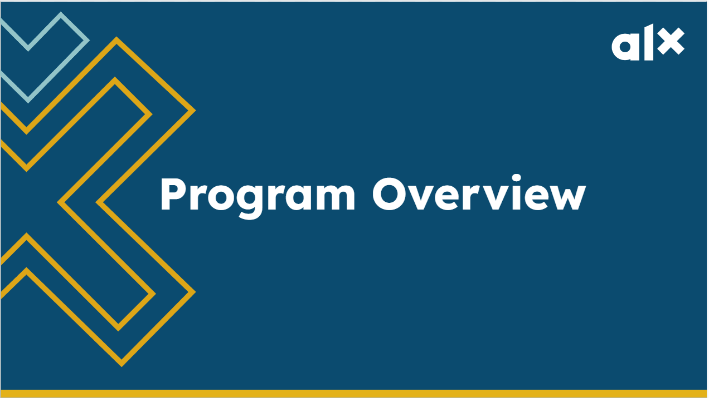
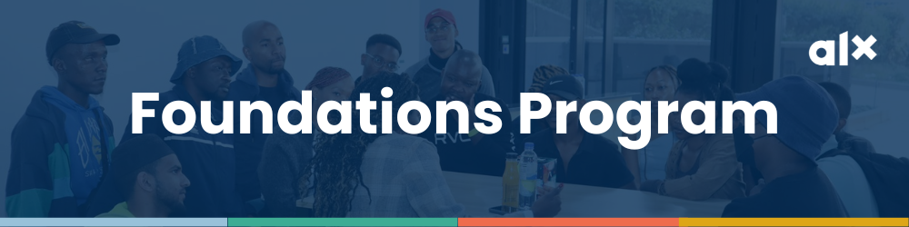
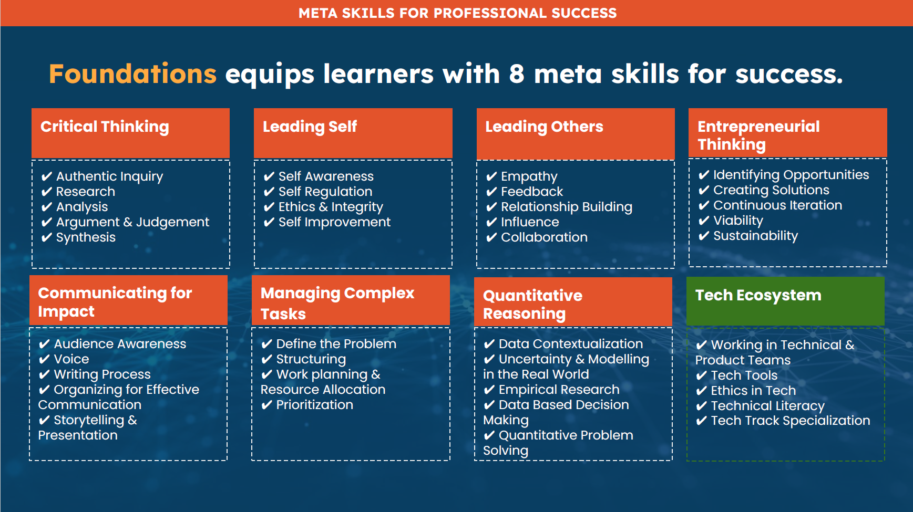

# ALX FOUNDATION PROGRAM OVERVIEW

## Program Overview Part 1

### What Makes this Program Unique?

**There are many programs out there that teach foundational tech skills so why is this program so unique?**

#### You’ll Acquire the Complete Package

You’ll receive training on skills that are in high demand in the professional world. Skills that some of the leading talent management consultancies and professionals swear by. Taking you far beyond just being a tech guru!

#### The Holistic Approach

The ALX Foundation Program will equip you with key tools, and critical soft and technical skills. You will also invest your time in discovering who you are, developing your character, forming healthy lifestyle habits, and exploring rewarding ways to merge your professional aspirations and mission. We will empower you to skillfully navigate and confidently lead the different aspects of your day-to-day.

#### The Content: “ALX Secret Sauce”

We have already talked about the secret sauce a few times. This program will unlock your ability to build and practice additional critical real-world skills that are highly sought after by employers and clients. As an ALX Professional Foundations Program grad, you will be self-aware, aligned with your values, a great communicator and collaborator, humble and empathetic, and an analytical and creative thinker. You will be well-equipped for your job search as you will hold insider secrets for successfully finding and creating work opportunities and standing out in job interviews.

#### Peer Support

As part of this program, you will become a member of a community. Within that community, you will belong to a smaller group called a Squad, which consists of other peers who are also going through the program. As Squad members, you will regularly communicate via Circle, offer peer coaching sessions to one another, and support and motivate one another throughout the entire learning journey.

From Squads, smaller teams are formed that collaborate on group projects (in-person or virtually). Many past ALX participants report that the connections made in their Squads and teams were what enabled them to complete the course successfully. These connections are often carried forward and form the foundation of the learners’ professional networks.

#### Real-World Focus and Applied Projects

Unlike traditional courses, all learning content and assignments/milestones are designed to help you develop critical skills that you actually need for the real world of work. Weekly Tests are designed to help you assess whether you have understood the content. Milestones are designed to simulate projects done in the workplace and provide you with actual work samples.

Read more about what makes the ALX Professional Foundations Program the amazing experience it is by downloading the program brochure [here](content/foundations_program.pdf).

