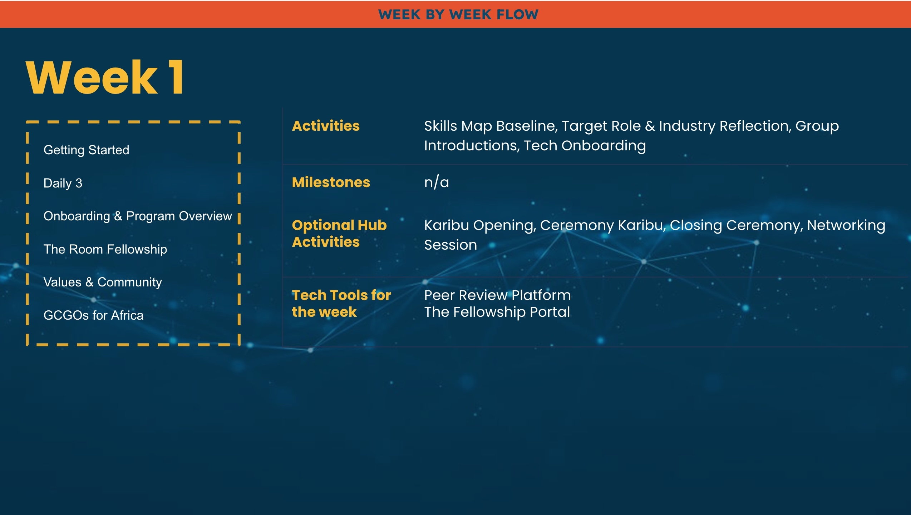
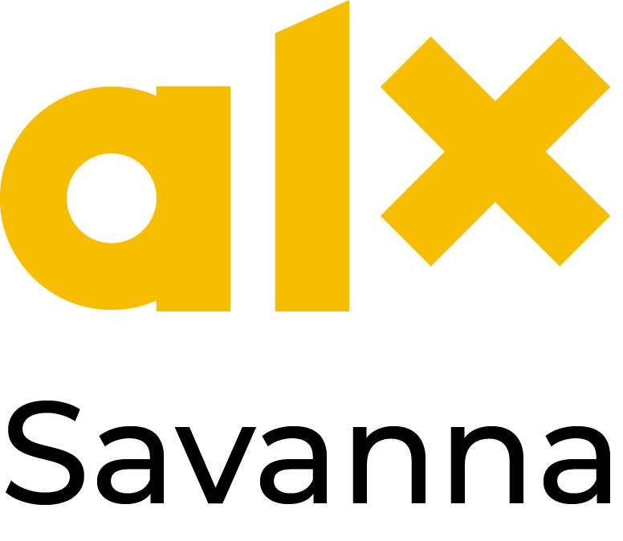
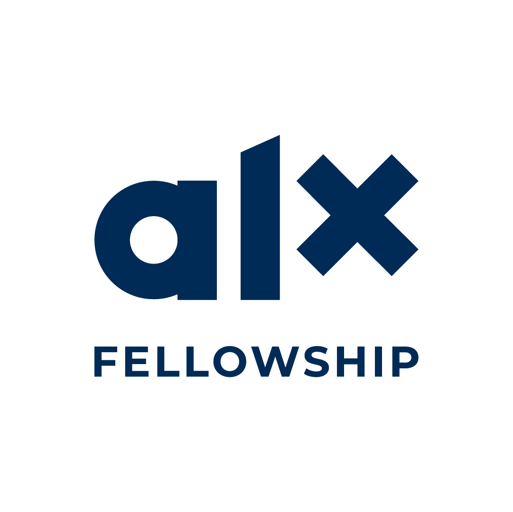
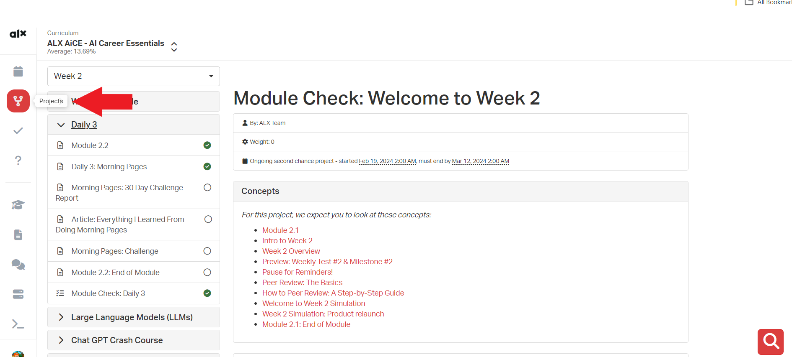
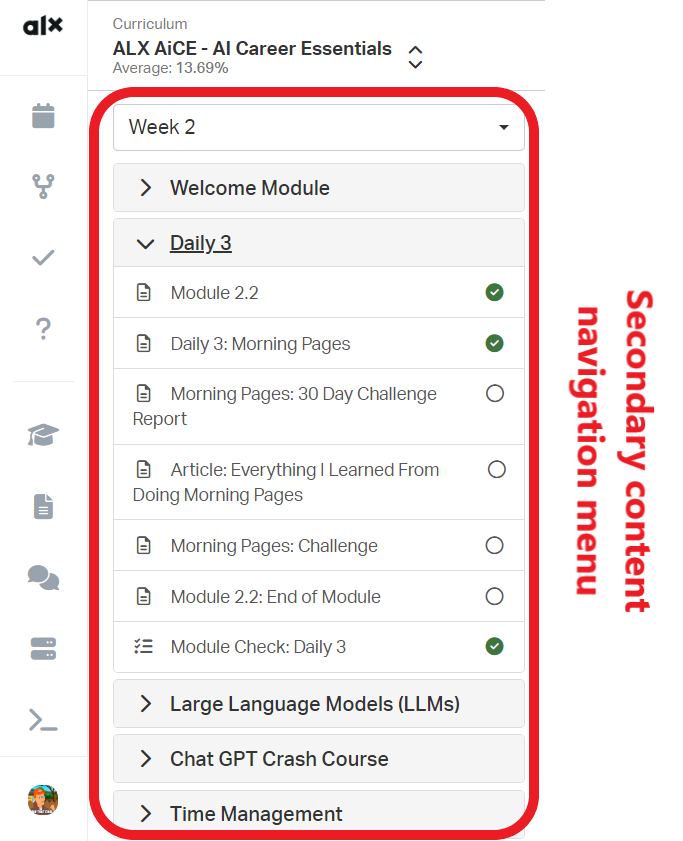
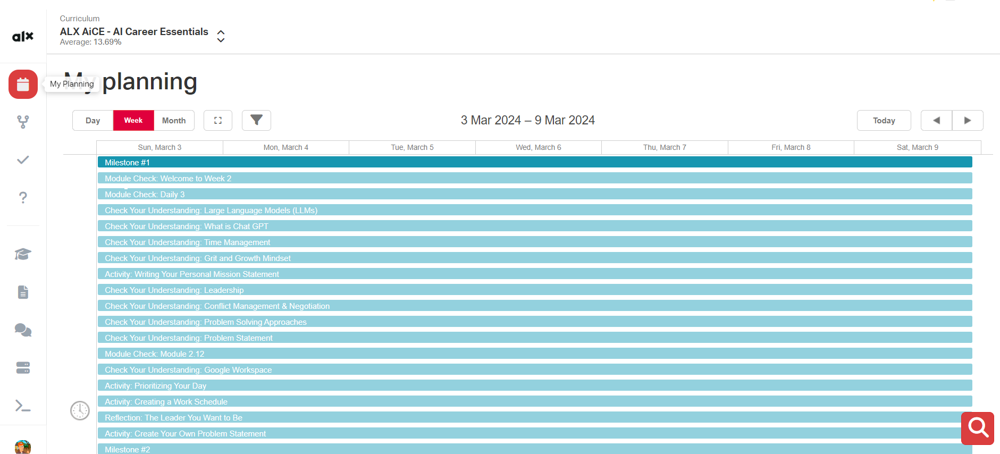

# ALX-Foundation Programme

This is a repository to hold all the works and tasks for the ALX Foundation programme.

## Welcome!

### Welcome to this Life Empowering Journey

You have made a great decision to be part of the rigorous and rewarding learning experience, that will position you for success in the real world of work. Let’s kick off with this video, packed with important welcome and onboarding information and an overview of what to expect.

Click play to watch the video. As you watch it, make sure that you have understood:

How the program is structured.
How to approach the content.
The 8 meta-skills covered in the program.
How your time in the program will be allocated.
The learning focus of Months 1 and 2?

Are you ready to supercharge and transform your trajectory as a young tech professional? We are too, so let’s do this!

If you need a transcript of this video, you can download a copy from <a href="https://docs.google.com/document/d/1iP2xznQdvNk8TUSWSECi6ezDX3HzF9q773pSv4QPeiQ/copy">here.</a>

>
> Refrences: <a href="https://drive.google.com/file/d/1QeVM7JK5HjVOpR_8QPMFQjK8kLiph3fb/view?usp=sharing">Video Reference</a>
>

## Why Complete the ALX Professional Foundations Program?

A key driver and motivator that propels people to achieve the unachievable, set new norms, break limits and successfully Do Hard Things is understanding the **WHY**.

### WHY Do We Require This Course (When maybe all you really want is to learn tech skills)?
Employers from across the globe are consistently frustrated with entry-level employees because they commonly lack essential 21st-century skills. Specifically, many people lack the ability to think critically and creatively to solve complex problems, to communicate both in writing and speaking, to manage themselves and their time, and to successfully collaborate with diverse team members to complete projects.

The ALX Professional Foundations course is designed to give you a strong advantage by providing you with “The ALX Special Sauce”– a curated combination of meaningful opportunities to learn, practice, and deepen the knowledge, skill sets, and character qualities that are highly desired by employers, but that are not taught in most tech training programs.

Our Special Sauce consists of the 8 Meta Skills that we listed in our welcome note and will share more about it shortly. We invite you to learn more about the WHY behind these meta-skills. They are discussed in more depth in this <a href="https://www.mckinsey.com/industries/public-sector/our-insights/defining-the-skills-citizens-will-need-in-the-future-world-of-work?cid=other-soc-lkn-mps-mck-oth-2106--&amp;sid=8452174334&amp;linkId=194255334">research article by McKinsey</a>, which shares what is truly needed to thrive in the future, ever-changing world of work. Let’s pause here, so you can read the article. It will help you get to realize just how important this course is for your future success!

>
> **question mark**
> As you read, identify in the article each of the 8 meta-skills that we focus on in this program. Happy Reading!
>

## Using Savanna

Your ALX Professional Foundations course content is all found here, on Savanna. In this tutorial video, we show you around Savanna so you can get comfortable with it. The course material is organized by modules with projects, which you can think of as chapters. Every week, new modules with projects will be unlocked so you can access them. We recommend that you go to “Projects” to view what you have completed and what you have yet to complete. Please go through the material in the order in which it is presented.

Please watch this mandatory tutorial on getting around Savanna. Please note that the course shown in the demo is close but not identical to yours and that any dates and content shown are just examples.

By the end of the video, make sure you can answer YES to these questions:

- Do I know where to go to see the modules and course content?
- Have I understood how to navigate Savanna (for example how to move to the next page)?
- Have I understood how to take a “Check Your Understanding” quiz?
- Have I understood how to take the Weekly Test?

>
> Refrences: <a href="https://www.youtube.com/watch?v=o75c90vuVqE">Savanna Walkthrough</a>
>

## Karibu Ceremony

**Need to know everything about this exciting journey before going full throttle? We have you covered.**

This Saturday, we will be hosting our Karibu Ceremonies. This is your big welcome to the AL family, where important introductory context will be shared.

The ceremony is compulsory and a required part of this program. So make sure you have all the details you need to attend. Keep a lookout for email communications on this matter!

In addition to the Ceremony and content here on Savanna, there are a plethora of orientation activities taking place throughout this week, online and at your nearest City Hub. You are expected to participate. Please take a moment right now to check your inbox for any ALX calendar invitations. Accept the invites, add them to your calendar and make note of what is happening and when.

This is the week to get set up, get ahead and understand what is in store. Missing the Karibu Ceremony and associated onboarding activities this week is not an option. How you start will strongly impact the rest of your journey here at ALX. If you get left behind there’s no Tesla fast enough to catch you up.

## Get to Know Your Course Designers and Guides

There is a HUGE army behind the scenes here. All of us are working to make sure that you and your peers are set up to succeed in this program. Here are some of the course designers you may come across during your journey.

Now that you have an idea of some of the many people working hard for your success, we are wide-eyed and excited to meet you too!

You should now (or very soon) have access to The Portal, a platform where you’ll have a chance to introduce yourself to us, and your peers in your Squad (your assigned peer group… More on that in a little bit).

## End of Module 1.1

What? We see you pulling winning stunts already!
Let’s celebrate this moment - you have just completed your first module in Savanna.
You really are on fire!
Take a short break and treat yourself to a snack.

## Module 2 - About Professional Foundations

### Programme Overview

We have created a program summary so you have an overview of what the next 2 months will entail. If you would like to scan through it you can go through the slides below. You can also download it [here](content/foundations_program.pdf) and keep a copy for yourself if you want.

The overview covers the key skills you will master in the first 2 months. It is a clear guide on what you will learn but please note that the flow of modules and content might move around as the week progresses. This will be to keep the content relevant and applicable to each week’s key takeaways.

Exciting times are ahead and we hope that seeing this overview will help you proactively plan ahead.

## What You Will Learn: 8 Meta Skills

### What are the next few months about and what will you be able to do by the time you’ve completed them?

#### We thought you’d never ask!

We are confident that the skills you will acquire here are gold! We’ve crafted a learning journey that will equip you with holistic skills that are highly sought after, and that most programs do not teach. You can think of these skills as a secret weapon that will:

+ Make you a more attractive job candidate,
+ Increase your job longevity and satisfaction,
+ Boost your confidence in global workspaces, and
+ Advance your professional relevance in tech.

During the earliest days of the African Leadership University, the AL team interviewed over 200 executives across Africa and around the world to discover the answer to one key question: **“What skills are most important for entry-level employees to have when they work for your company?”**

What resulted from this was a list of 7 meta-skills that almost all employers agreed were _essential _to success for young people in today’s modern workplace. In addition to the 7 meta-skills above – due to the rapidly evolving employment and tech landscape – we added one more meta-skill on Tech Ecosystems.

The 8 meta skills are broken down below.

This course will empower you to navigate and appropriately interact in a variety of professional settings. It will increase your intellectual and creative capacity, sharpen your data-driven mindset and critical thinking skills, empower your career path by helping you connect with your personal mission, equip you to better manage yourself and work with others, and enable you to set a high standard of professional excellence.

You have just become part of a network of the continent’s leading talent in tech!

## How Our Lessons Have Impacted Students

Are you excited yet? Watch the video below with ALX alumni sharing about their experience, the learning model and how it changed their lives.

**As you watch try to answer the following for yourself:**

+ 1 What does “learn fast and fail fast” mean to me?
+ 2 What does “do hard things” mean for me?
+ 3 What lifelong benefits will this program add to my professional journey?

If you are still curious to hear more, you can <a href="https://www.youtube.com/@ALXAfrica/videos" target="_blank">watch more [OPTIONAL] inspiring videos here.</a>

>
> Refrences: <a href="https://www.youtube.com/watch?v=BNmyYzosV-E" target="_blank">ALX Experience</a>
> Refrences: <a href="https://www.youtube.com/@ALXAfrica/videos" target="_blank">Other Testimonials</a>
>

## Week 1 Overview

There are several moving pieces this week and we want to set clear expectations so you can give each one the required attention.

Watch this next video for a detailed overview of what to expect for the rest of this week. As you watch the video, make note of:

+ 1 What you need to do to complete Week 1 successfully.
+ 2 How the rest of Week 1 is structured.
+ 3 Week #1 Test submission deadlines.

So what are you waiting for? Let’s go!

If you need a transcript of this video, you can download it <a href="https://docs.google.com/document/d/1E4x18oIW9SB5eCmHC4a3DLqsLdNSrY9XGwsMO1UaZeg/copy">here.</a>

>
> Refrences: <a href="https://drive.google.com/file/d/1NcFS5YLzkkECg8XKYMpzwVtkmmxDDN8F/view?usp=sharing">Week One</a>
>

## Tech Onboarding - Personal Toolkit (Savanna & ALX Portal)

The ALX Portal and Savanna are the two main tools you must employ in this course if you want to succeed. This week, setting up and becoming accustomed to each of these tools should be your first priority.

By now, you should have received instructions on how to get started on each of the platforms. Please be sure to carefully follow the instructions provided for each of the tools.

[

We have already talked about Savanna (where you are right now!) This is where you will spend most of your time absorbing content and this is where you will submit your practice quizzes and Weekly Tests. This is also the place where you will submit your weekly Milestones and do your peer evaluations.

You will access ALX’s community through The Portal. This is the place where you will communicate with fellow students online and get help from ALX staff when needed. This is also where you will receive announcements, and participate in virtual community activities and discussions. In short, this is your WhatsApp x Insta for the duration of this course!

## Navigating Savanna

[

As we mentioned in the Savanna Tutorial Video our course is organized by modules with projects, which you can think of as chapters. Every week, a new set of modules will be unlocked so you can access them. The modules, and the pages within them, are meant to be studied in the order they are presented. There is a natural progression to the material, so it will not be helpful for you to jump around. You can access the projects (and their relate modules) you have to complete from the left navigation bar by clicking the “Projects” icon.

[

Clicking on any of the projects will show you the details of how modules and pages are arranged within the course. You can navigate them from the from the secondary navigation bar on the left.

[

You can also access your projects from the “My Planning” where you’ll find all your projects and submission requirements in a calendar timeline.

[

HAPPY SAVANNA EXPLORING!

